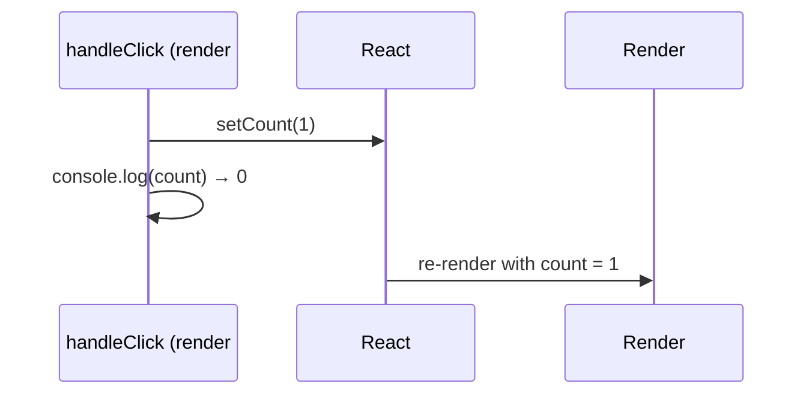

Lets a function component store state.

```jsx
const [count, setCount] = useState(0);
```

For updates based on the previous state, prefer the updater form:

```jsx
setCount((prev) => prev + 1);
```

Each render sees a **snapshot** of state. Inside one event handler, `count` is a fixed value, so calling `setCount(count + 1)` twice queues "set to 1" twice — it only increments once. The updater form receives the latest queued value instead.

```text
count = 0

setCount(count + 1);   // queue: "replace with 0 + 1"
setCount(count + 1);   // queue: "replace with 0 + 1"
→ result: 1

setCount(p => p + 1);  // queue: 0 → 1
setCount(p => p + 1);  // queue: 1 → 2
→ result: 2
```

## Why doesn't state update immediately?

`setState` doesn't change the variable in the current render — it schedules a re-render. The new value is visible in the **next** render.

```jsx
const handleClick = () => {
  setCount(count + 1);
  console.log(count); // still the old value
};
```



---
