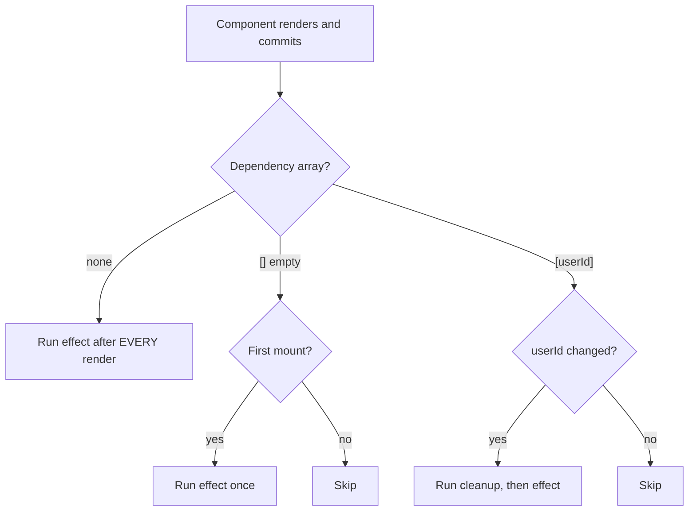
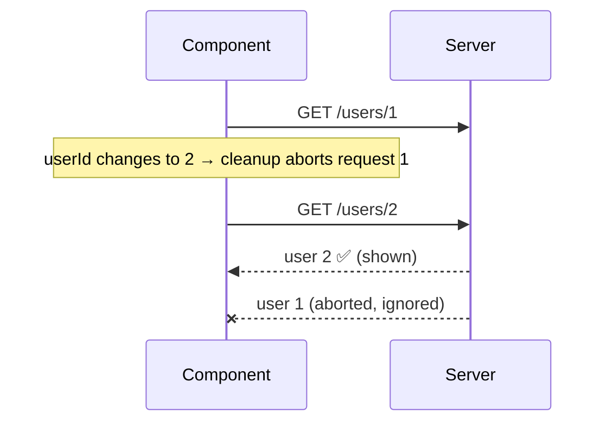

Lets a component synchronize with external systems: API subscriptions, event listeners, timers, browser APIs, WebSocket connections.

```jsx
useEffect(() => {
  document.title = `Count: ${count}`;
}, [count]);
```

## Dependency Array

```jsx
useEffect(() => {
  // after every render
});

useEffect(() => {
  // after the initial mount only
}, []);

useEffect(() => {
  // whenever userId changes
}, [userId]);
```

React compares dependencies between renders (with `Object.is`) and re-runs the effect when one changes.



## Cleanup

Effects can return a cleanup function.

```jsx
useEffect(() => {
  const handleResize = () => console.log(window.innerWidth);

  window.addEventListener('resize', handleResize);

  return () => {
    window.removeEventListener('resize', handleResize);
  };
}, []);
```

Cleanup runs when:

- The component unmounts
- Before the effect runs again because a dependency changed

It prevents memory leaks, duplicate subscriptions, stray listeners, and timers that keep firing after unmount.

```text
Mount              → effect(userId=1)
userId changes 1→2 → cleanup(userId=1) → effect(userId=2)
userId changes 2→3 → cleanup(userId=2) → effect(userId=3)
Unmount            → cleanup(userId=3)
```

**Note:** in Strict Mode during development, React mounts, unmounts, and remounts components once — so effects run twice. This is intentional, to surface missing cleanup.

## Fetching data in useEffect (race conditions)

If `userId` changes quickly, an older request can finish **after** a newer one and overwrite the correct data. Ignore or abort stale responses in the cleanup.

```jsx
useEffect(() => {
  const controller = new AbortController();

  fetch(`/api/users/${userId}`, { signal: controller.signal })
    .then((res) => res.json())
    .then(setUser)
    .catch((err) => {
      if (err.name !== 'AbortError') setError(err);
    });

  return () => controller.abort();
}, [userId]);
```



In real apps, a data library (TanStack Query, SWR) or framework loader handles this for you.

---
