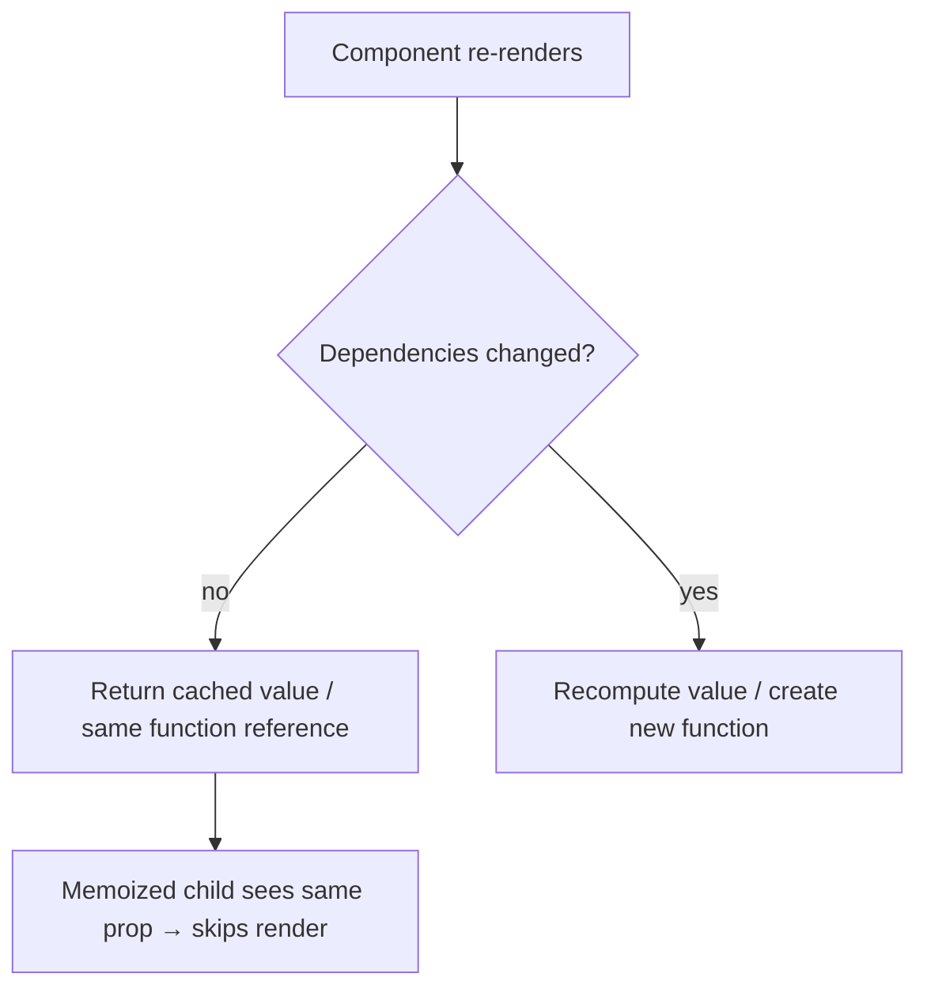

```jsx
// useMemo → memoize a VALUE
const expensiveValue = useMemo(() => calculateSomething(data), [data]);

// useCallback → memoize a FUNCTION reference
const handleClick = useCallback(() => doSomething(id), [id]);
```

`useCallback(fn, deps)` is just shorthand for `useMemo(() => fn, deps)`.



**When to use them:** for genuinely expensive calculations, or to keep a stable reference for a `React.memo` child or an effect dependency. Wrapping everything adds cost without benefit.

---
