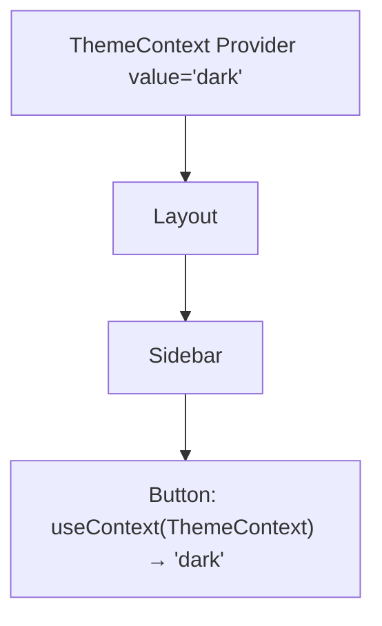

Lets a component consume data from React Context without passing props through every intermediate level.

Common use cases: theme, authentication info, locale, app configuration.

```mermaid
flowchart TD
    Prov["ThemeContext Provider value='dark'"] --> A["Layout"]
    A --> B["Sidebar"]
    B --> C["Button: useContext(ThemeContext) → 'dark'"]
```

---
