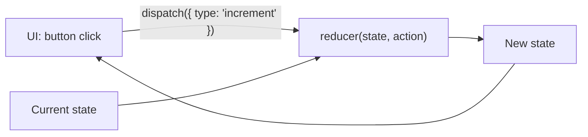

Useful for more complex state transitions.

```jsx
const [state, dispatch] = useReducer(reducer, initialState);

function reducer(state, action) {
  switch (action.type) {
    case 'increment':
      return { ...state, count: state.count + 1 };
    default:
      return state;
  }
}
```

Think: **State + Action → Reducer → New State**



**useState vs useReducer:** use `useState` for simple independent values; use `useReducer` when the next state depends on several values or many actions update the same state.

---
