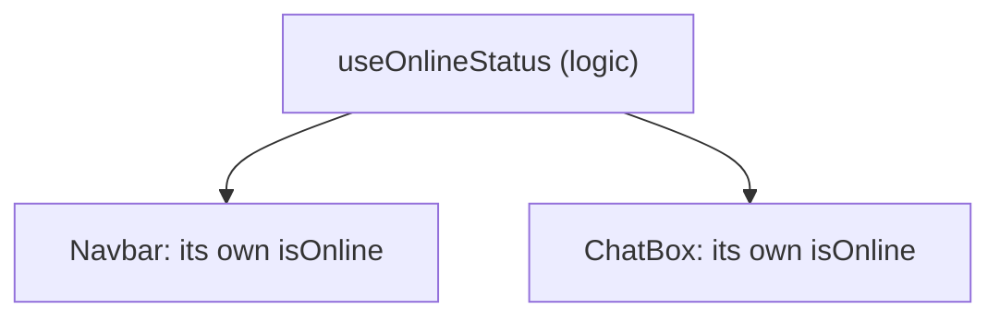

A reusable function that uses React Hooks to share **stateful logic** between components.

```jsx
function useOnlineStatus() {
  const [isOnline, setIsOnline] = useState(navigator.onLine);

  useEffect(() => {
    const goOnline = () => setIsOnline(true);
    const goOffline = () => setIsOnline(false);
    window.addEventListener('online', goOnline);
    window.addEventListener('offline', goOffline);
    return () => {
      window.removeEventListener('online', goOnline);
      window.removeEventListener('offline', goOffline);
    };
  }, []);

  return isOnline;
}
```

Custom hooks share logic, **not state** — each component that calls one gets its own independent state.



---
