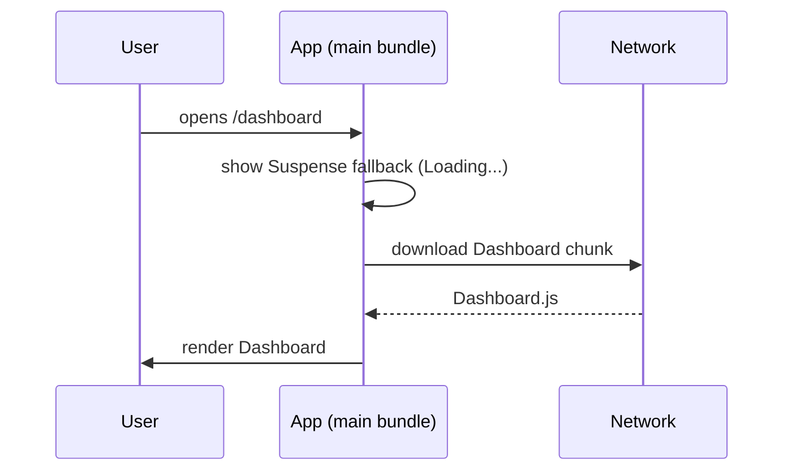

Loading JavaScript only when it's needed, instead of shipping the whole app up front.

```jsx
const Dashboard = lazy(() => import('./Dashboard'));

<Suspense fallback={<Loading />}>
  <Dashboard />
</Suspense>;
```

This reduces the initial bundle and improves first load.



---
