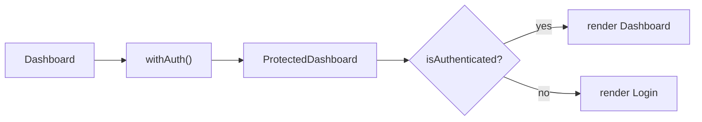
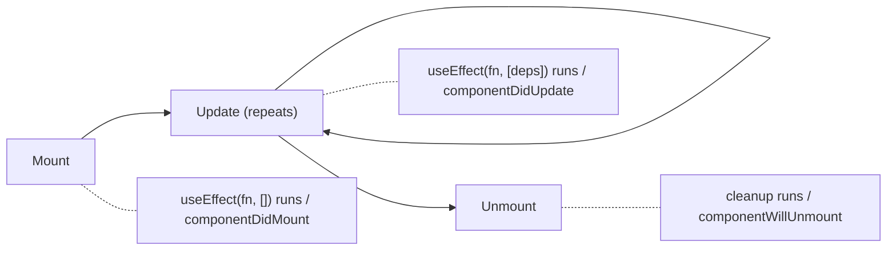
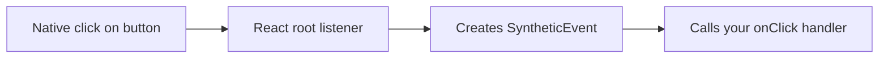
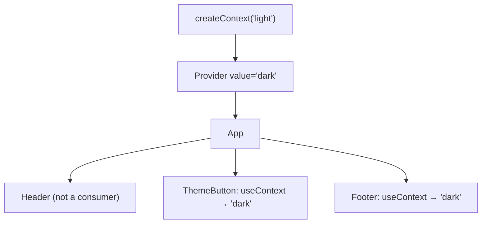
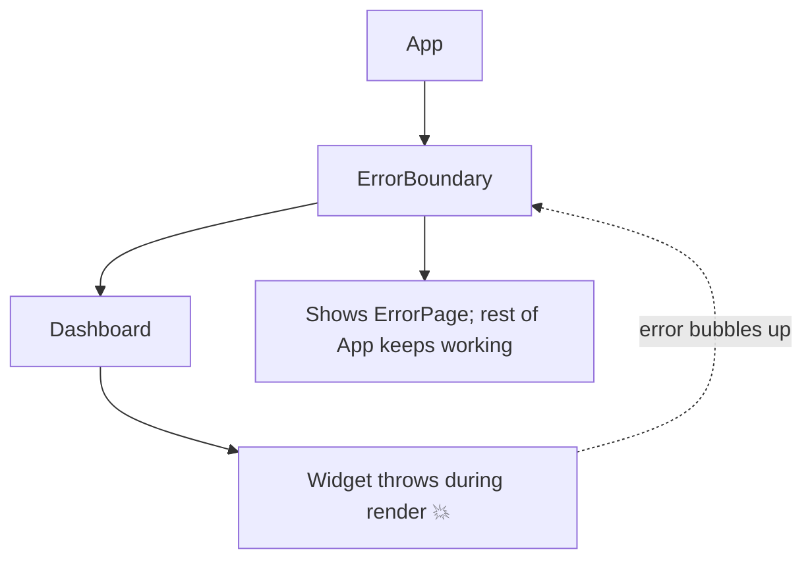
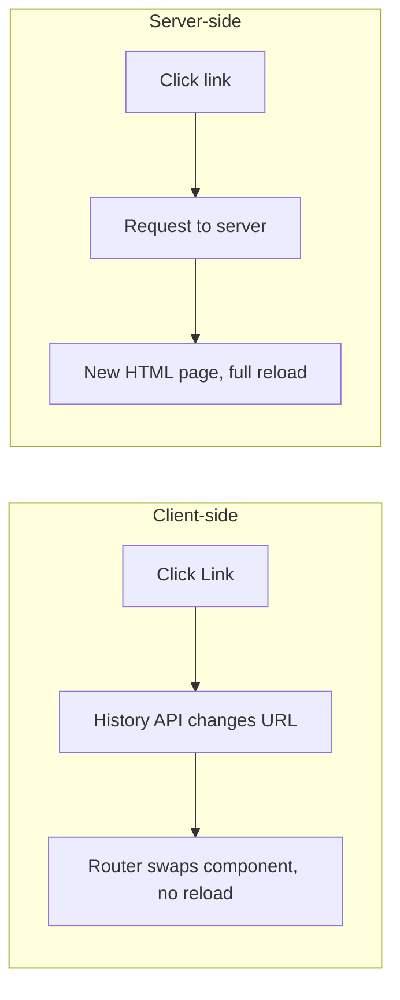

### Higher-Order Components (HOC)

A function that takes a component and returns an enhanced component.

```jsx
function withAuth(Component) {
  return function ProtectedComponent(props) {
    if (!isAuthenticated) {
      return <Login />;
    }
    return <Component {...props} />;
  };
}
```

HOCs were common before Hooks. Today most use cases are better handled with custom hooks, composition, or context.



---

### Component Lifecycle

Three conceptual phases:

- **Mount** — the component is added to the UI
- **Update** — props or state change and React renders again
- **Unmount** — the component is removed from the UI

In function components this is handled with hooks, mainly `useEffect`.



---

### Event Bubbling

An event triggered on a child propagates upward through its ancestors.

```jsx
<div onClick={() => console.log('parent')}>
  <button onClick={() => console.log('button')}>Click</button>
</div>
```

Clicking the button logs `button` then `parent`. Stop it with:

```jsx
event.stopPropagation();
```

```text
click on <button>
   │  logs "button"
   ▼ bubbles up
<div> logs "parent"
   ▼
document / root
```

---

### Synthetic Events

React wraps native browser events in a **SyntheticEvent** object that behaves the same in every browser. React attaches listeners at the **root** container (event delegation) instead of on each element.



---

### Context API

Makes data available to a component subtree without passing props through every level.

```jsx
const ThemeContext = createContext('light');

// Provide (React 19+)
<ThemeContext value="dark">
  <App />
</ThemeContext>;

// React 18 and earlier
<ThemeContext.Provider value="dark">
  <App />
</ThemeContext.Provider>;

// Consume
const theme = useContext(ThemeContext);
```

The Context API is the overall mechanism of creating, providing, and consuming context. `useContext()` is how function components consume it.

**Caveat:** when the context value changes, every consumer re-renders. Split contexts or memoize the value object to limit this.



---

### Error Boundaries

Catch errors during rendering and show fallback UI instead of crashing the whole tree.

```jsx
<ErrorBoundary fallback={<ErrorPage />}>
  <Dashboard />
</ErrorBoundary>
```

They catch errors in rendering, lifecycle methods, and constructors of descendant components.

They do **not** catch errors in event handlers, async code, server-side rendering, or the boundary itself. Error boundaries must be class components (or use a library like `react-error-boundary`).



---

### Strict Mode

A development-only wrapper that helps find bugs. It does nothing in production.

In development it:

- Renders components **twice** to catch impure render logic
- Runs effects **mount → unmount → mount** to catch missing cleanup
- Warns about deprecated APIs

```text
<StrictMode> in development:
render() → render() again     (results must be identical)
effect() → cleanup() → effect()  (cleanup must undo the effect)
```

**"Why does my console.log / API call run twice?"** — Strict Mode in development. It is not a bug, and it doesn't happen in production.

---

### Client-Side vs Server-Side Routing

**Client-Side Routing** — navigation happens in the browser without a full page reload.

- Fast navigation
- Preserves client state
- More app-like experience

**Server-Side Routing** — the browser requests a URL from the server.

The server decides what to return for that route.



---
