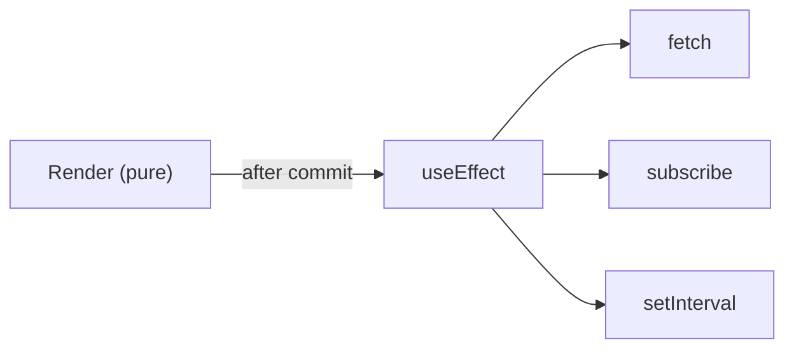
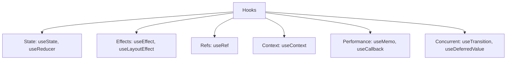

### Q36. What is Strict Mode in React?
A development-only helper that surfaces unsafe patterns and side effects. See [Strict Mode](../../07-javascript/level-3/03-strict-mode.md).

### Q32. Common side effects in React components?
Data fetching, subscriptions, timers, DOM operations, analytics, and storage interactions. They belong in `useEffect` or event handlers, never in the render body.

### Q45. Types of React hooks?
Core hooks include `useState`, `useEffect`, `useContext`, `useRef`, `useMemo`, `useCallback`, `useReducer`, and concurrent hooks like `useTransition` and `useDeferredValue`.

---
