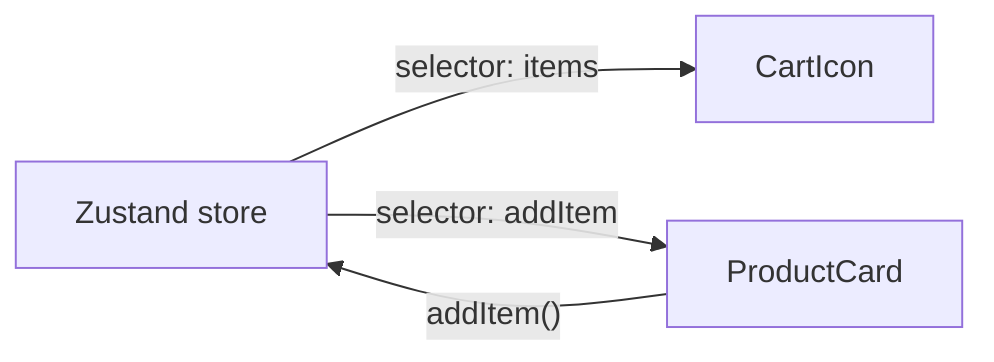

### Q70. What is Zustand and why is it used?
A lightweight React state library for simple global state with low boilerplate.

```jsx
const useCartStore = create((set) => ({
  items: [],
  addItem: (item) => set((state) => ({ items: [...state.items, item] })),
}));

const items = useCartStore((state) => state.items);
```



### Q71. Zustand vs Context API vs Redux?
Zustand offers simpler setup than Redux and finer subscriptions than basic Context in many cases.

### Q72. When should you choose Zustand?
When you need shared state beyond local component scope but want minimal setup and good performance.

---
