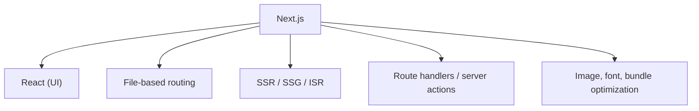

### Q76. Main difference between React and Next.js?
React is a UI library; Next.js is a React framework with routing, SSR/SSG, APIs, and production features.

### Q77. When should you use Next.js instead of React?
Use Next.js for SEO-sensitive, content-heavy, or full-stack apps requiring SSR/SSG.

---
