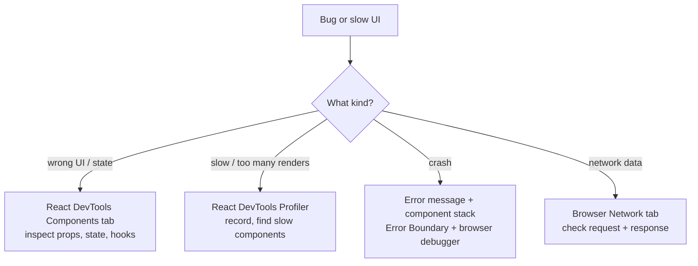
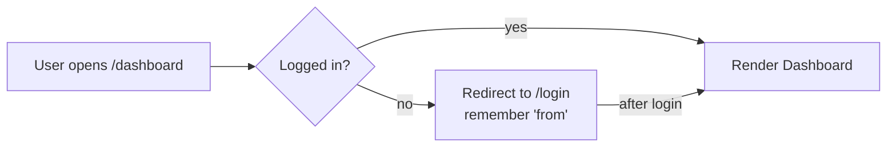

These come from the questions that repeat across the popular React interview lists (for example GreatFrontEnd's top React questions) and were missing above.

### Q94. React Node vs React Element vs React Component?

```jsx
function Button({ label }) {           // Component: a function that returns UI
  return <button>{label}</button>;
}

const element = <Button label="Save" />; // Element: a plain object describing UI

// Node: anything React can render
// element, 'text', 42, null, false, [<li key="1" />, <li key="2" />]
```

```text
Component ──called by React──► returns Elements ──► rendered into the DOM

<Button label="Save" />   is just this object (an Element):
{
  type: Button,                ← which component / tag
  props: { label: 'Save' },
  key: null
}
```

| Term | What it is | Example |
| ---- | ---------- | ------- |
| **Component** | A function (or class) that returns UI | `function Button() {}` |
| **Element** | An immutable object describing what to render | `<Button />`, `<div />` |
| **Node** | Anything renderable (elements, strings, numbers, arrays, `null`) | the type of `children` |

---

### Q95. What is `useId` and when should you use it?

`useId` generates a **unique, stable ID** that is the same on the server and the client. Use it to connect labels and inputs, or `aria-*` attributes.

```jsx
function EmailField() {
  const id = useId();
  return (
    <>
      <label htmlFor={id}>Email</label>
      <input id={id} type="email" aria-describedby={`${id}-hint`} />
      <p id={`${id}-hint`}>We never share your email.</p>
    </>
  );
}
```

```text
<EmailField />  → id ":r0:"     label ─htmlFor─► input
<EmailField />  → id ":r1:"     no clash even with two forms on one page
```

- Don't use `Math.random()` — the server and client would get different IDs (hydration mismatch).
- Don't use it for **list keys** — keys should come from your data.

---

### Q96. What is `forwardRef`? What changed in React 19?

A parent sometimes needs direct access to a child's DOM node (to focus an input, scroll, measure). Normally `ref` was not passed as a prop, so you had to wrap the child in `forwardRef`.

```jsx
// React 18
const TextInput = forwardRef(function TextInput(props, ref) {
  return <input ref={ref} {...props} />;
});
```

```jsx
// React 19 — ref is a normal prop for function components
function TextInput({ ref, ...props }) {
  return <input ref={ref} {...props} />;
}

// Parent (same in both versions)
function Form() {
  const inputRef = useRef(null);
  return (
    <>
      <TextInput ref={inputRef} />
      <button onClick={() => inputRef.current.focus()}>Focus</button>
    </>
  );
}
```

```text
Form
 │ inputRef ──────────────┐
 ▼                        │ ref passed down
TextInput                 │
 └─ <input ref={ref}> ◄───┘   inputRef.current = the real <input> DOM node
```

**`useImperativeHandle`** — expose only selected methods instead of the whole DOM node:

```jsx
function TextInput({ ref }) {
  const inner = useRef(null);
  useImperativeHandle(ref, () => ({
    focus: () => inner.current.focus(),
  }));
  return <input ref={inner} />;
}
```

---

### Q97. How do you reset a component's state?

Give it a different **`key`**. When the key changes, React throws away the old component and mounts a fresh one with initial state.

```jsx
// Switching from Ali's chat to Sara's should clear the draft message
<ChatBox key={contactId} contact={contact} />
```

```text
key="ali"   <ChatBox> state: { draft: "hey Ali..." }
               │ contactId changes to "sara"
               ▼
key="sara"  old ChatBox UNMOUNTED (state destroyed)
            new ChatBox MOUNTED   state: { draft: "" }  ✓
```

Without the key, React sees the same component in the same position and **keeps** the old state — a common bug.

---

### Q98. What are render props? HOC vs render props vs hooks?

A **render prop** is a prop that is a function, which the component calls to know what to render. It shares logic without inheritance.

```jsx
function MouseTracker({ render }) {
  const [pos, setPos] = useState({ x: 0, y: 0 });
  return (
    <div onMouseMove={(e) => setPos({ x: e.clientX, y: e.clientY })}>
      {render(pos)}
    </div>
  );
}

<MouseTracker render={({ x, y }) => <p>Mouse at {x}, {y}</p>} />;

// Today the same logic is usually a custom hook
function useMousePosition() {
  const [pos, setPos] = useState({ x: 0, y: 0 });
  useEffect(() => {
    const move = (e) => setPos({ x: e.clientX, y: e.clientY });
    window.addEventListener('mousemove', move);
    return () => window.removeEventListener('mousemove', move);
  }, []);
  return pos;
}
```

```text
HOC            withMouse(Component)        → wraps the component, injects props
Render prop    <Mouse render={fn} />       → component calls fn(data)
Hook           const pos = useMouse()      → logic returns data directly  ✓ simplest
```

| | HOC | Render props | Custom hook |
| - | --- | ------------ | ----------- |
| Extra components in tree | Yes (wrapper hell) | Yes (nesting) | No |
| Where data comes from | Hidden props | Function argument | Explicit return value |
| Still used for | Auth wrappers, libraries | Some libraries (Formik, Downshift) | **Default choice today** |

---

### Q99. Presentational vs Container components?

```text
Container (smart)                     Presentational (dumb)
- fetches data, holds state           - only receives props
- knows about APIs, stores            - only renders UI
                │                        ▲
                └──── props ─────────────┘

<UserListContainer>  ──users, onDelete──►  <UserList users onDelete />
```

```jsx
function UserListContainer() {
  const { data: users, isLoading } = useUsers();      // data logic
  if (isLoading) return <Spinner />;
  return <UserList users={users} />;                  // pass to UI
}

function UserList({ users }) {                        // easy to test & reuse
  return <ul>{users.map((u) => <li key={u.id}>{u.name}</li>)}</ul>;
}
```

With hooks, the "container" is often just a **custom hook** (`useUsers`), but the idea — keep data logic separate from UI — is still what interviewers want to hear.

---

### Q100. What are the pitfalls of Context, and how do you reduce re-renders?

Every component that reads a context re-renders when the context **value changes** — and a new object each render counts as a change.

```jsx
// ✗ New object every render → all consumers re-render every time AuthProvider renders
function AuthProvider({ children }) {
  // ...user, login, logout defined here
  return <AuthContext value={{ user, login, logout }}>{children}</AuthContext>;
}
```

```jsx
// ✓ Memoize the value — same object until user/login/logout actually change
function AuthProvider({ children }) {
  // ...user, login, logout defined here
  const value = useMemo(() => ({ user, login, logout }), [user, login, logout]);
  return <AuthContext value={value}>{children}</AuthContext>;
}
```

```text
One big context { user, theme, cart }
  cart changes ──► Header (reads theme) re-renders ✗
               ──► Avatar (reads user)  re-renders ✗
               ──► CartIcon (reads cart) re-renders ✓

Split into ThemeContext / UserContext / CartContext
  cart changes ──► only CartIcon re-renders ✓
```

**Fixes:**

1. **Memoize** the value object (`useMemo`) and functions (`useCallback`).
2. **Split** contexts by how often they change (e.g. state vs dispatch, theme vs cart).
3. **Move state down** — not everything needs to be global.
4. For frequently changing global state, use a store with **selectors** (Zustand, Redux) so components subscribe only to the slice they use.

---

### Q101. What are common pitfalls when fetching data in React?

```text
✗ Race condition   type "re" → request A (slow)
                   type "rea" → request B (fast)
                   B arrives, then A arrives → UI shows results for "re" ✗

✗ Waterfall        Parent fetches → renders Child → Child fetches → renders Grandchild → fetches
                   ███
                      ███
                         ███        3 round trips one after another

✓ Parallel         start all requests together (Promise.all / fetch in parent / loader)
                   ███
                   ███
                   ███
```

| Pitfall | Fix |
| ------- | --- |
| Race conditions | `AbortController` in the effect cleanup, or ignore stale responses |
| No loading / error / empty states | Handle all four states every time |
| Waterfalls | Fetch in parallel, fetch higher up, or use route loaders / Server Components |
| Same data fetched by many components | A cache: TanStack Query, SWR, RTK Query |
| Fetching in `useEffect` without cleanup | Abort on unmount / dependency change |
| Storing server data in Redux by hand | Server-state library handles caching, refetching, retries |

---

### Q102. How do you debug a React application?



- **Components tab:** select a component, see its props/state/hooks, edit them live.
- **Profiler:** "Highlight updates when components render" shows what re-renders and why.
- `debugger;` statements and breakpoints in the browser Sources tab.
- **StrictMode** surfaces missing effect cleanups and impure renders in development.

---

### Q103. What are common React anti-patterns?

| ✗ Anti-pattern | ✓ Better |
| -------------- | -------- |
| Mutating state: `items.push(x); setItems(items)` | `setItems([...items, x])` |
| Copying props into state (`useState(props.user)`) | Use the prop directly, or reset with `key` |
| `useEffect` to compute derived data | Calculate during render |
| Index as `key` in a list that can reorder | A stable ID from the data |
| Defining components inside components | Define them at the top level |
| One huge component doing everything | Split by responsibility |
| Prop drilling 5+ levels | Composition (`children`) or context |
| Fetching in effects with no cleanup | `AbortController` or a data library |
| `useMemo` / `useCallback` everywhere "just in case" | Measure first; or let the React Compiler handle it |

```text
Component defined INSIDE another component

function Parent() {
  function Child() {...}     ← a NEW function every render
  return <Child />;          ← React sees a new type → unmounts + remounts Child
}                              every time → state lost, inputs lose focus
```

---

### Q104. "You Might Not Need an Effect" — when NOT to use useEffect?

Effects are for syncing with **external systems** (network, DOM APIs, subscriptions, timers). Using them for things React can do during render causes extra renders and bugs.

```jsx
// ✗ Effect to compute derived data — renders twice, briefly shows stale value
const [fullName, setFullName] = useState('');
useEffect(() => {
  setFullName(`${first} ${last}`);
}, [first, last]);
```

```jsx
// ✓ Calculate during render
const fullName = `${first} ${last}`;
```

```text
✗ With effect                          ✓ During render
render (fullName = old) ─► commit      render (fullName = new) ─► commit   done
  └─ effect: setFullName(new)
render again (fullName = new) ─► commit
```

| Situation | Use instead of an effect |
| --------- | ------------------------ |
| Value computed from props/state | Compute during render (`useMemo` if expensive) |
| Reacting to a user click / submit | Put the logic in the **event handler** |
| Reset state when a prop changes | `key` on the component |
| Fetching data | A data library, loader, or Server Component |
| Syncing with a non-React widget, subscription, timer | ✓ This is what effects are for |

---

### Q105. How do you render a list of 10,000 items efficiently?

Rendering 10,000 DOM rows is slow even if each row is simple. Use **virtualization (windowing)**: render only the rows visible on screen, plus a small buffer.

```text
Full list (10,000 rows)          Viewport              Rendered DOM
row 0                                                   (only ~20 rows)
...                         ┌───────────────┐
row 4,998                   │ row 5,000      │ ◄────── row 4,995 – 5,020
row 5,000   ──────────────► │ row 5,001      │          + empty spacer above and
...                         │ ...            │            below to keep the
row 5,015                   │ row 5,015      │            scrollbar correct
...                         └───────────────┘
row 9,999
```

```jsx
import { FixedSizeList } from 'react-window';

<FixedSizeList height={600} itemCount={items.length} itemSize={40} width="100%">
  {({ index, style }) => <div style={style}>{items[index].name}</div>}
</FixedSizeList>
```

Other options: **pagination** or **infinite scroll** (load more as you go), and `React.memo` on rows so they don't re-render when unrelated state changes. Libraries: `react-window`, `react-virtuoso`, TanStack Virtual.

---

### Q106. How do you create protected routes (React Router)?

```jsx
function ProtectedRoute({ children }) {
  const { user } = useAuth();
  const location = useLocation();

  if (!user) {
    return <Navigate to="/login" replace state={{ from: location }} />;
  }
  return children;
}

<Route
  path="/dashboard"
  element={
    <ProtectedRoute>
      <Dashboard />
    </ProtectedRoute>
  }
/>;
```



**Important:** this only hides UI. The **API must check auth on every request** — anyone can call your API directly.

---

### Q107. How do you localize (i18n) a React app?

```jsx
import { useTranslation } from 'react-i18next';

function Greeting({ name }) {
  const { t } = useTranslation();
  return <h1>{t('greeting', { name })}</h1>;
}

// en.json  { "greeting": "Hello, {{name}}" }
// ur.json  { "greeting": "السلام علیکم، {{name}}" }
```

```text
t('greeting')  ──► current language = ur ──► ur.json ──► "السلام علیکم، Ali"
```

- Keep text in translation files, never hard-coded in components.
- Format dates, numbers, and currency with the built-in **`Intl`** API (`Intl.NumberFormat`, `Intl.DateTimeFormat`).
- Right-to-left languages (Urdu, Arabic): set `dir="rtl"` on `<html>`.

---
