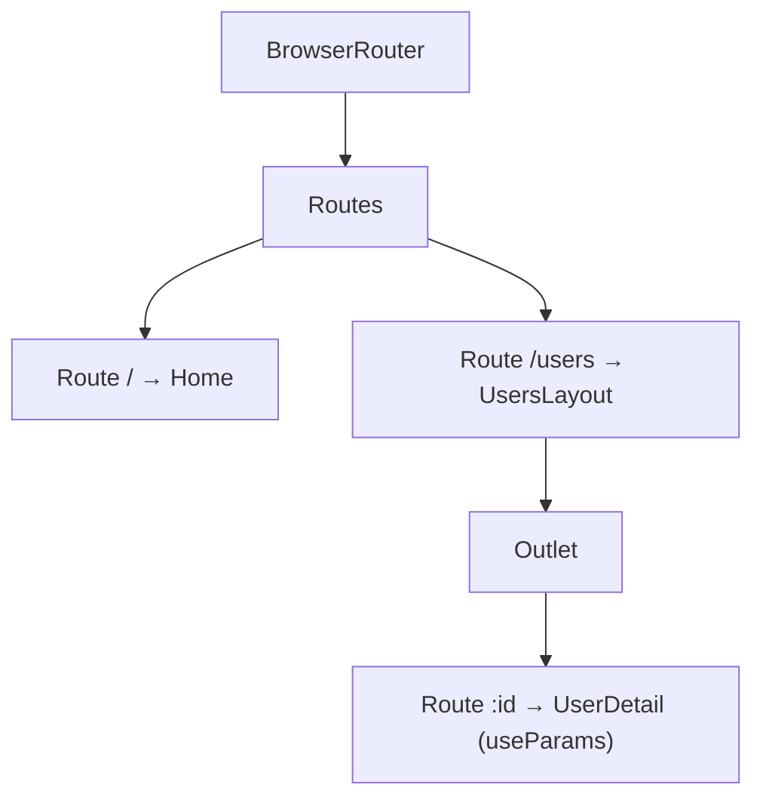
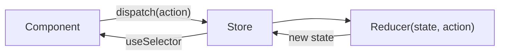

### B. Routing and State Management

### Q49. Components of React Router?
`BrowserRouter`, `HashRouter`, `Routes`, `Route`, `Link`, `NavLink`, `Outlet`, and hooks like `useNavigate`, `useParams`, `useLocation`, `useSearchParams`.

### Q50. What is Redux?
A predictable state management library using store, actions, reducers, and immutable updates.

### Q51. Components of Redux?
Store, actions, reducers, dispatch, and subscribers/selectors.

### Q54. Context API vs Redux?
Context is lightweight for shared state; Redux is stronger for complex large-scale workflows.

| Context API                                | Redux (Toolkit)                                  |
| ------------------------------------------ | ------------------------------------------------ |
| Built into React                           | External library                                 |
| Every consumer re-renders on value change  | Components subscribe to slices via selectors     |
| Good for theme, auth, locale               | Good for large, frequently changing global state |
| No devtools / middleware                   | Devtools, middleware, time-travel debugging      |

---
