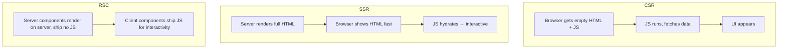
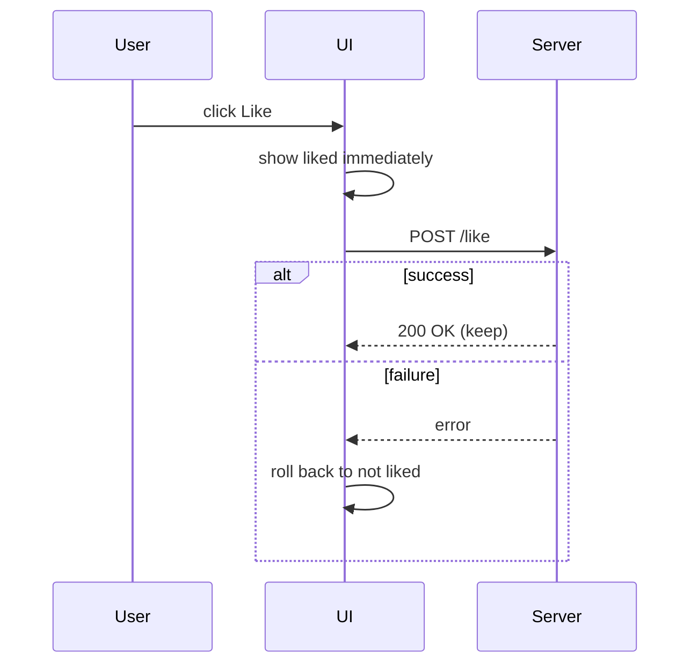
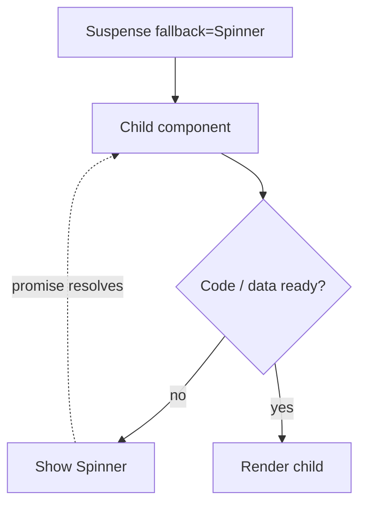

### A. Architecture, Performance, and Concurrent React

### Q59. SSR vs CSR vs React Server Components?
- SSR: HTML generated on server, better SEO and initial load.
- CSR: UI rendered in browser, strong SPA experience.
- RSC: Some components run on server to reduce client bundle and improve performance.



### Q61. Common performance bottlenecks and mitigations?
- Unnecessary re-renders -> memoization
- Large bundles -> code splitting
- Long lists -> virtualization
- Heavy sync work -> offload/chunk tasks

```text
Long list (10,000 rows) without virtualization:  10,000 DOM nodes
With virtualization (react-window):              ~20 visible rows in the DOM
┌──────────────┐
│ row 41       │ ← only rows inside the viewport exist
│ row 42       │
│ ...          │
│ row 60       │
└──────────────┘
```

### Q62. How to implement optimistic UI updates, and trade-offs?
Update UI immediately, rollback on error, and refetch to sync. Trade-off: complexity around rollback and conflict handling.



### Q63. React Server Components vs client components?
RSC run on server (lighter client bundles), while client components handle interactivity in the browser.

| Server Component                     | Client Component (`'use client'`)    |
| ------------------------------------ | ------------------------------------ |
| Runs only on the server              | Runs in the browser (and SSR)        |
| Can read DB / filesystem directly    | Can use state, effects, event handlers |
| Sends zero JS for itself             | Its JS is sent to the browser        |

### Q64. Explain concurrent rendering.
React can prioritize urgent updates and pause/resume lower-priority rendering work.

```text
Typing in search box (urgent)       ██ ██ ██ ██      ← always responsive
Filtering 10k results (transition)    ░░  ░░░  ░░░░  ← paused/resumed in between
```

```jsx
const [isPending, startTransition] = useTransition();

function handleChange(e) {
  setQuery(e.target.value); // urgent
  startTransition(() => {
    setFilter(e.target.value); // can wait
  });
}
```

### Q65. What is `useDeferredValue` and when to use it?
Defers non-urgent updates to keep typing/search UI responsive.

```jsx
const deferredQuery = useDeferredValue(query);
const results = useMemo(() => filterItems(items, deferredQuery), [items, deferredQuery]);
```

```text
query:          "r" → "re" → "rea" → "reac"     (input updates instantly)
deferredQuery:  "r" ──────────────► "reac"       (list catches up when idle)
```

### Q66. How does Suspense work for data fetching and code splitting?
Suspense shows fallback UI while async code/data resolves, then renders the target subtree.



### Q68. How does automatic batching improve performance?
React groups multiple updates in one render cycle, reducing render count and DOM work. See [Automatic Batching](#automatic-batching).

### Q69. What are React Portals and what do they solve?
Portals render outside parent DOM hierarchy, useful for modals/tooltips and z-index/overflow issues.

```jsx
return createPortal(<Modal />, document.body);
```

```text
React tree:              DOM tree:
App                      <div id="root">
 └─ Card                   └─ <div class="card" style="overflow:hidden">
     └─ Modal (portal)   <body>
                           └─ <div class="modal">   ← rendered here, not clipped
```

Events from a portal still bubble through the **React** tree (to `Card`), not the DOM tree.

---
