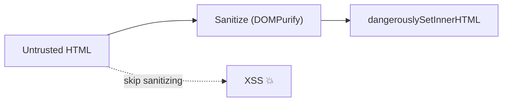

### Q84. How does React protect applications from XSS attacks?
React escapes interpolated JSX content by default.

```text
const name = '';
<p>{name}</p>   →  shown as plain text, not executed ✅
```

### Q85. What is `dangerouslySetInnerHTML`, and why is it risky?
It injects raw HTML and can introduce XSS unless content is strictly sanitized (for example with DOMPurify).



### Q86. Best practices for securing React apps?
Sanitize untrusted input, avoid raw HTML injection, secure auth flows, and keep dependencies updated.

---
