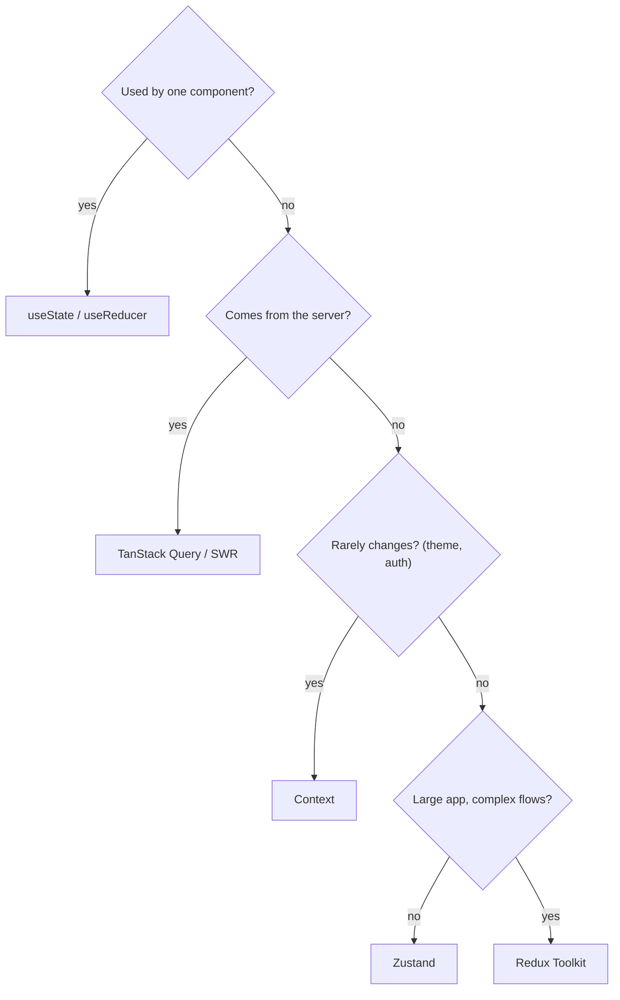

### Q87. How do you structure a large-scale React app?
Use feature modules, shared packages, strict boundaries, testing, and scalable state architecture.

```text
src/
├── app/            # routing, providers, layout
├── features/
│   ├── auth/       # components, hooks, api, types for auth
│   ├── cart/
│   └── products/
├── shared/
│   ├── ui/         # Button, Modal, Input
│   ├── hooks/
│   └── lib/        # api client, formatters
└── main.tsx
```

Features import from `shared/`, never from each other.

### Q88. How do you handle performance in large React apps?
Profile first, reduce unnecessary renders, split bundles, virtualize lists, and optimize data/state flow.

### Q89. How do you choose state management for large apps?
Use local state first, Context for light sharing, Zustand for medium complexity, Redux Toolkit for complex workflows.



---
