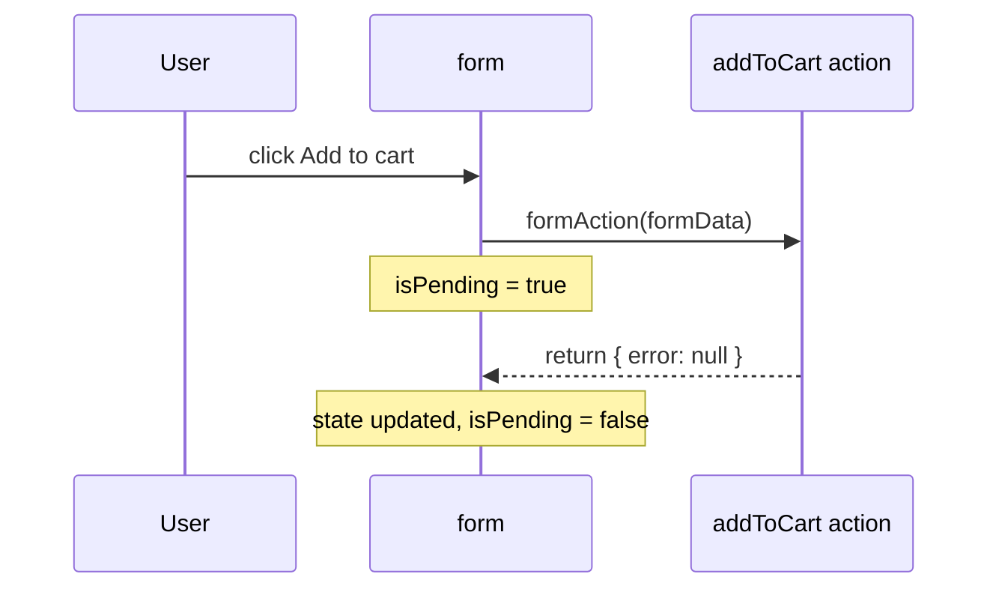

### Q108. What's new in React 19?

| Feature | What it does |
| ------- | ------------ |
| **Actions** | Pass async functions to `<form action={fn}>` / transitions; React tracks pending, errors, and resets forms |
| `useActionState` | State + pending flag for a form action |
| `useFormStatus` | A child of a `<form>` can read whether it is submitting |
| `useOptimistic` | Show the expected result instantly while the request is in flight |
| `use()` | Read a promise or context during render (can be called conditionally) |
| `ref` as a prop | No `forwardRef` needed for function components |
| `<Context>` as provider | `<ThemeContext value="dark">` instead of `.Provider` |
| Document metadata | Render `<title>` / `<meta>` anywhere; React moves them to `<head>` |
| Server Components & Server Actions | Stable for frameworks like Next.js |
| **React Compiler** (separate tool) | Automatic memoization at build time |

---

### Q109. What are Actions and `useActionState`?

```jsx
async function addToCart(prevState, formData) {
  const res = await saveToCart(formData.get('productId'));
  if (!res.ok) return { error: 'Could not add item' };
  return { error: null };
}

function AddToCartButton({ productId }) {
  const [state, formAction, isPending] = useActionState(addToCart, { error: null });

  return (
    <form action={formAction}>
      <input type="hidden" name="productId" value={productId} />
      <button disabled={isPending}>{isPending ? 'Adding…' : 'Add to cart'}</button>
      {state.error && <p role="alert">{state.error}</p>}
    </form>
  );
}
```



Before React 19 you wrote this by hand: `useState` for loading, `useState` for error, `try/catch/finally`, `e.preventDefault()`. Actions remove that boilerplate.

---

### Q110. What is `useOptimistic`?

Show the result **immediately**, and let React roll it back automatically if the real update fails.

```jsx
function LikeButton({ likes, onLike }) {
  const [optimisticLikes, addOptimisticLike] = useOptimistic(
    likes,
    (current, amount) => current + amount
  );

  async function likeAction() {
    addOptimisticLike(1);   // UI shows +1 now
    await onLike();         // server request
  }

  return (
    <form action={likeAction}>
      <button>❤️ {optimisticLikes}</button>
    </form>
  );
}
```

```text
click ──► optimistic: 10 → 11 (instant)
            │
            ├─ server OK   → parent passes likes = 11 → stays 11 ✓
            └─ server fail → action ends, likes still 10 → shows 10 again (rolled back)
```

Must be called inside an **Action or transition** (here the form action).

---

### Q111. What is the `use()` hook?

`use` reads the value of a **promise** or **context** during render. With a promise, the component **suspends** until it resolves, showing the nearest `<Suspense>` fallback.

```jsx
function Comments({ commentsPromise }) {
  const comments = use(commentsPromise);       // waits here
  return comments.map((c) => <p key={c.id}>{c.text}</p>);
}

function Post({ commentsPromise }) {
  return (
    <Suspense fallback={<p>Loading comments…</p>}>
      <Comments commentsPromise={commentsPromise} />
    </Suspense>
  );
}

// Unlike other hooks, it can be conditional
function Theme({ show }) {
  if (!show) return null;
  const theme = use(ThemeContext);   // ✓ allowed after an early return
  return <p>{theme}</p>;
}
```

```text
render Comments ─► use(promise) pending ─► suspend ─► show "Loading comments…"
                                 resolved ─► render again ─► comments on screen
```

**Gotcha:** don't create the promise inside the same component's render (`use(fetch(...))`) — a new promise every render means it never settles. Create it in a parent, a Server Component, or a cache.

---

### Q112. Does the React Compiler remove the need for `useMemo` and `useCallback`?

The **React Compiler** is a build-time tool that analyses your components and adds memoization automatically.

```text
You write                                  Compiler outputs (conceptually)
function List({ items, filter }) {         function List({ items, filter }) {
  const visible = items.filter(...)          const visible = memo([items, filter], ...)
  const onClick = () => ...                  const onClick = memo([...], ...)
  return <Row onClick={onClick} />           return memoizedJSX
}                                          }
```

- In a project **with the compiler enabled**, you rarely need manual `useMemo`, `useCallback`, or `React.memo`.
- It only works if your code follows the **Rules of React** (pure render, no mutating props/state). Code that breaks them is skipped.
- Interviewers still ask *why* memoization matters, so you must understand referential equality and unnecessary re-renders.
- Many existing codebases don't use the compiler yet — manual memoization is still everywhere.

---

### Q113. `useTransition` vs `useDeferredValue`?

Both mark work as **low priority** so typing and clicking stay responsive.

```jsx
// useTransition — you control the state update
const [isPending, startTransition] = useTransition();
function handleTab(tab) {
  startTransition(() => setTab(tab));   // heavy re-render is interruptible
}

// useDeferredValue — you only receive a value (e.g. a prop)
const deferredQuery = useDeferredValue(query);
const results = useMemo(() => filterBig(list, deferredQuery), [list, deferredQuery]);
```

```text
Typing "react"
input value    r → re → rea → reac → react        (urgent: updates every key)
heavy list     ......................... react     (deferred: catches up when idle)
```

| `useTransition` | `useDeferredValue` |
| --------------- | ------------------ |
| Wraps the **state update** | Wraps a **value** |
| Use when you own the `setState` call | Use when the value comes from props/elsewhere |
| Gives `isPending` | Compare `value !== deferredValue` to show "stale" |

---
