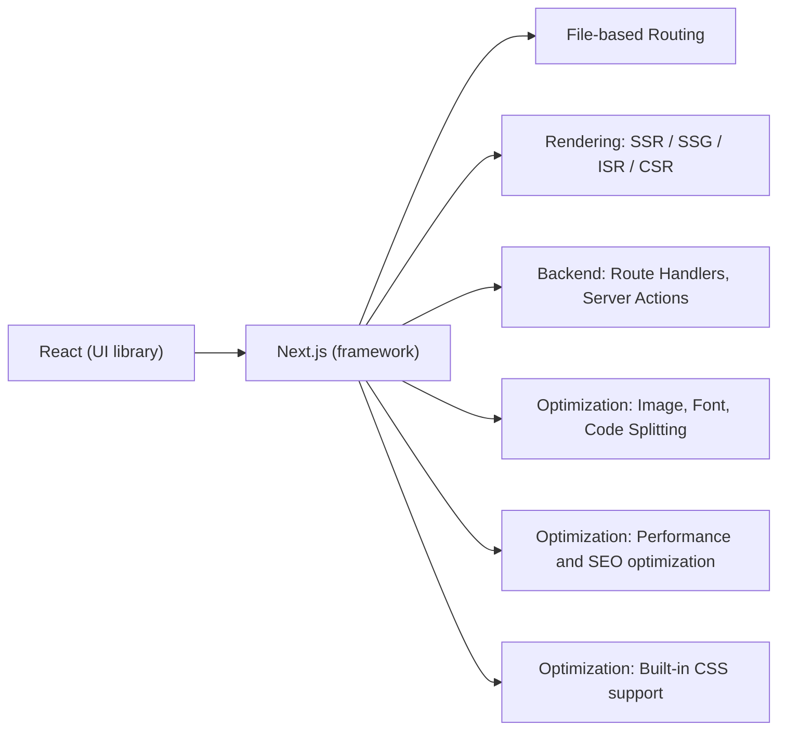

---

**Next.js** is a React framework built on top of React that provides additional features like:

```mermaid
flowchart LR
    R["React (UI library)"] --> N["Next.js (framework)"]
    N --> A["File-based Routing"]
    N --> B["Rendering: SSR / SSG / ISR / CSR"]
    N --> C["Backend: Route Handlers, Server Actions"]
    N --> D["Optimization: Image, Font, Code Splitting"]
    N --> E["Optimization: Performance and SEO optimization"]
    N --> F["Optimization: Built-in CSS support"]
```

---
