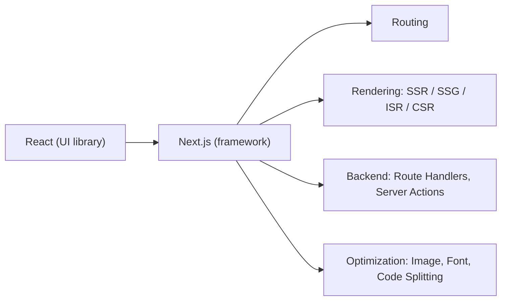

---

**Next.js** is a React framework built on top of React that provides additional features like:

* Server-Side Rendering (SSR)
* Static Site Generation (SSG)
* Incremental Static Regeneration (ISR)
* File-based routing
* API routes (Route Handlers)
* Image optimization
* Automatic code splitting
* TypeScript support
* Built-in CSS support
* Performance and SEO optimization

---
