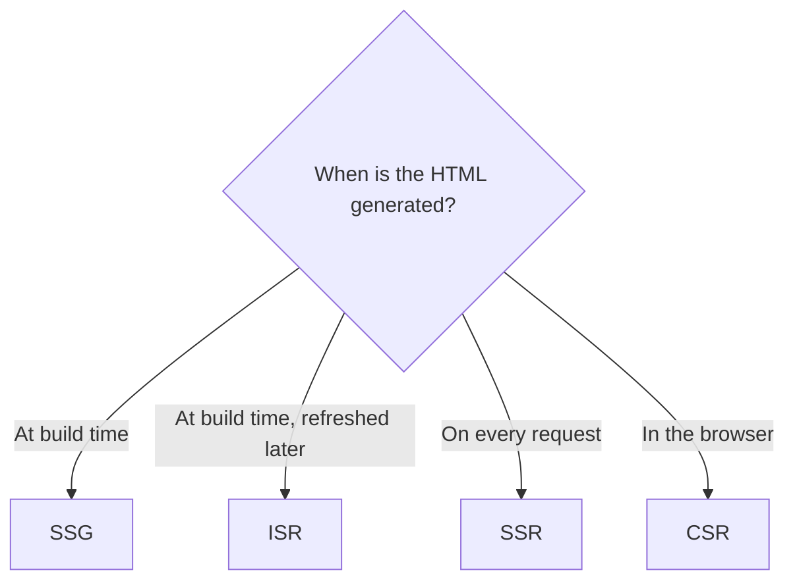
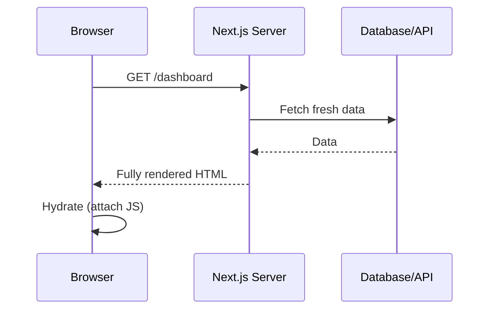
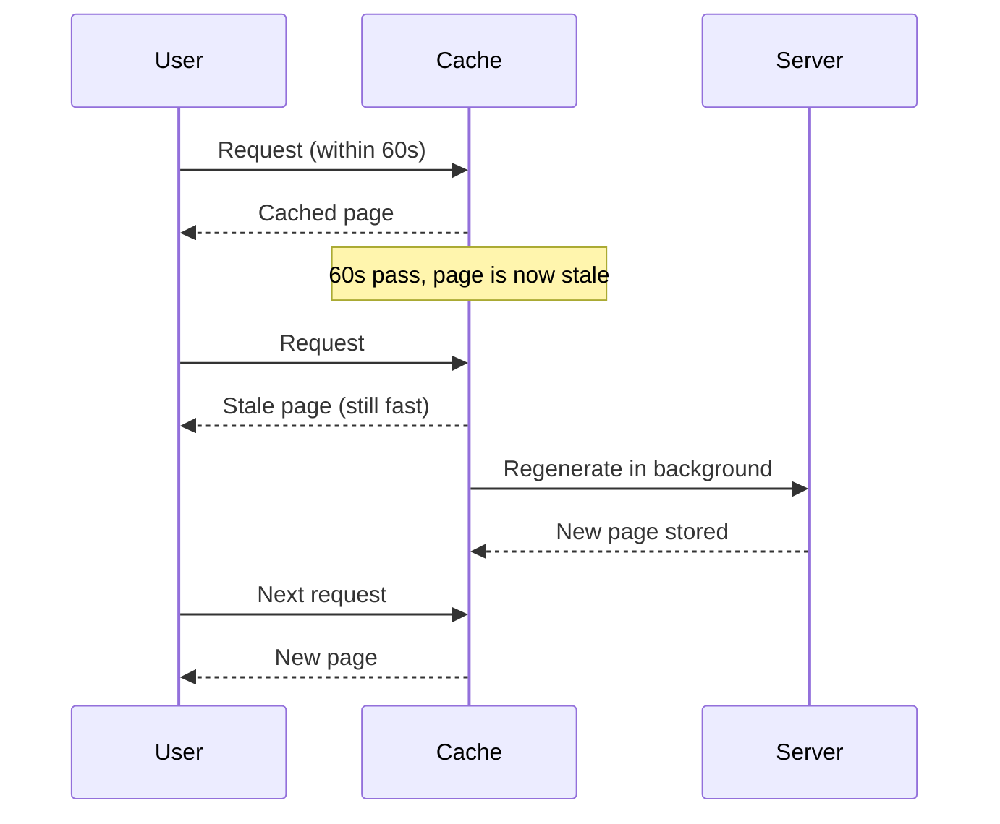

Next.js supports multiple rendering strategies.



| Pattern | HTML generated        | Data freshness       | Speed      | Example                  |
| ------- | --------------------- | -------------------- | ---------- | ------------------------ |
| SSG     | Build time            | Stale until rebuild  | Fastest    | Blog, docs               |
| ISR     | Build + background    | Refreshed every N s  | Very fast  | Product pages, news      |
| SSR     | Every request         | Always fresh         | Slower     | Dashboard, personalized  |
| CSR     | In the browser        | Fetched by client    | Slow first load | Highly interactive app |

---

## 1. Server-Side Rendering (SSR)

HTML is generated on the server for **every request** before being sent to the browser.

### Best for:

* Dynamic pages
* Personalized dashboards
* Real-time data



Benefits:

* Fresh data on every request
* Better SEO
* Faster first paint than CSR (content arrives in the HTML)

In the App Router, a page becomes dynamic (SSR) when it uses request data such as `cookies()`, `headers()`, `searchParams`, or opts out with `export const dynamic = "force-dynamic"`.

---

## 2. Static Site Generation (SSG)

HTML is generated **once during build time** and reused for all users.

### Best for:

* Blogs
* Documentation websites
* Marketing pages

```text
next build ──► fetch data ──► generate HTML ──► upload to CDN
                                                    │
                     User 1, User 2, User 3 ◄───────┘  (same HTML for everyone)
```

Benefits:

* Very fast
* CDN friendly
* Good SEO

---

## 3. Incremental Static Regeneration (ISR)

ISR allows static pages to be updated in the background after deployment without rebuilding the entire application. It works as **stale-while-revalidate**.

### Best for:

* Product pages
* News websites
* Content websites

```tsx
// app/products/[id]/page.tsx
export const revalidate = 60; // regenerate at most once every 60 seconds
```



---

## 4. Client-Side Rendering (CSR)

Traditional React rendering where the browser downloads JavaScript and renders the UI on the client.

### Best for:

* Highly interactive applications
* User dashboards behind a login (no SEO needed)

```text
Browser ──► empty HTML ──► download JS ──► React runs ──► fetch data ──► UI renders
            (blank page until here ─────────────────────────────────┘)
```

---
