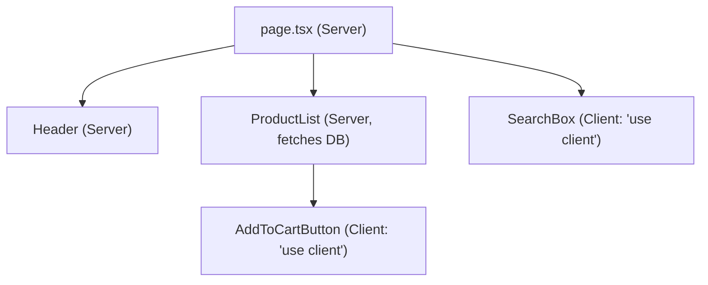

| Server Component                      | Client Component                  |
| ------------------------------------- | --------------------------------- |
| Runs only on the server               | Pre-rendered on the server, then hydrated and run in the browser |
| Adds no JavaScript to the bundle      | Adds JavaScript to browser bundle |
| Can fetch data directly (`async`)     | Used for interactive UI           |
| Can access backend resources securely (DB, secrets) | Uses hooks and browser APIs |
| Cannot use state, effects, or event handlers | Supports state, events, and hooks |
| Default in the `app` directory        | Opt in with `"use client"`        |

**Rule:** keep components on the server by default, and push `"use client"` down to the smallest interactive leaf.

---
