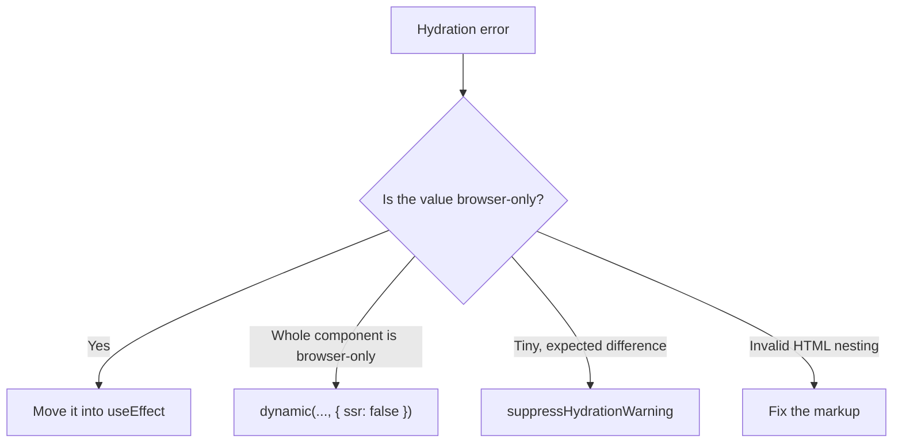

Solutions:

### 1. Use `useEffect`

Run client-only code after hydration.

```tsx
const [date, setDate] = useState<Date | null>(null);

useEffect(() => {
  setDate(new Date());
}, []);
```

### 2. Disable SSR for Specific Components

Use dynamic imports. In the App Router, `ssr: false` is only allowed inside a **Client Component**.

```tsx
"use client";

import dynamic from "next/dynamic";

const Component = dynamic(
  () => import("./Component"),
  { ssr: false }
);
```

### 3. Suppress an unavoidable mismatch

For a single element like a timestamp: `<time suppressHydrationWarning>{time}</time>`.



---
