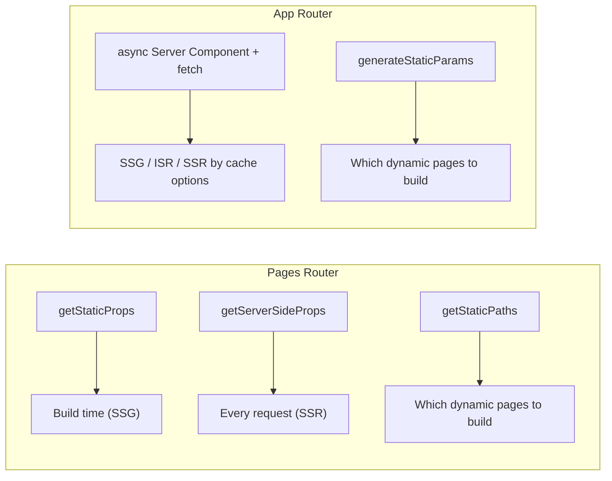

## getStaticProps (Pages Router)

Fetches data during build time.

Used for:

* Static pages
* Blogs
* Documentation

---

## getServerSideProps (Pages Router)

Fetches data on every request.

Used for:

* Dynamic data
* User-specific pages

---

## generateStaticParams (App Router)

Replacement for `getStaticPaths`.

Generates dynamic routes at build time.

Example:

```tsx
export async function generateStaticParams() {
  return [
    { id: "1" },
    { id: "2" }
  ];
}
```

```text
next build ──► generateStaticParams() → [{id:"1"},{id:"2"}]
                    │
                    ├──► /products/1  (static HTML)
                    └──► /products/2  (static HTML)
```

---
