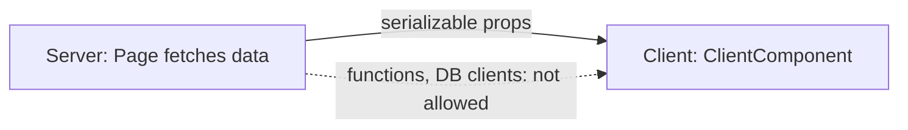

Data is passed using **props**. Props must be **serializable** (plain objects, strings, numbers, arrays, Dates) — you cannot pass functions, class instances, or DB connections.

Example:

```tsx
// Server Component

export default async function Page() {
  const data = await getData();

  return <ClientComponent data={data} />;
}
```

```tsx
// Client Component

"use client";

export default function ClientComponent({ data }: { data: { name: string } }) {
  return <div>{data.name}</div>;
}
```



---
