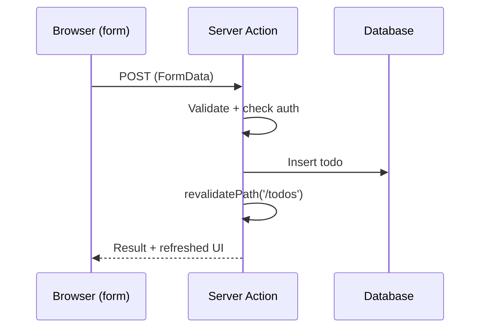

Server Actions are `async` functions marked with `"use server"` that run on the server but can be called directly from a form or a Client Component. They replace many "write an API route just to handle a form" cases.

```tsx
// app/actions.ts
"use server";

import { revalidatePath } from "next/cache";

export async function createTodo(formData: FormData) {
  const title = String(formData.get("title") ?? "").trim();
  if (!title) return { ok: false, error: "Title is required" };

  await db.todo.create({ data: { title } });
  revalidatePath("/todos");
  return { ok: true };
}
```

```tsx
// app/todos/page.tsx
import { createTodo } from "../actions";

export default function Page() {
  return (
    <form action={createTodo}>
      <input name="title" />
      <button type="submit">Add</button>
    </form>
  );
}
```



**Important:** a Server Action is a public POST endpoint. Always validate input and check authentication inside it.

---
