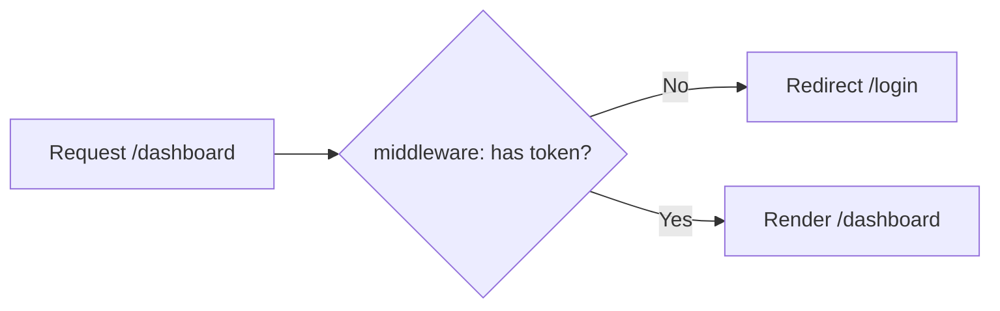

`middleware.ts` at the project root runs **before** a request reaches a route. Used for auth redirects, i18n, A/B tests, and rewriting URLs. It runs on the Edge runtime by default, so keep it light (no heavy DB calls).

```ts
// middleware.ts
import { NextResponse, type NextRequest } from "next/server";

export function middleware(request: NextRequest) {
  const token = request.cookies.get("token");
  if (!token) {
    return NextResponse.redirect(new URL("/login", request.url));
  }
  return NextResponse.next();
}

export const config = {
  matcher: ["/dashboard/:path*"],
};
```



---
