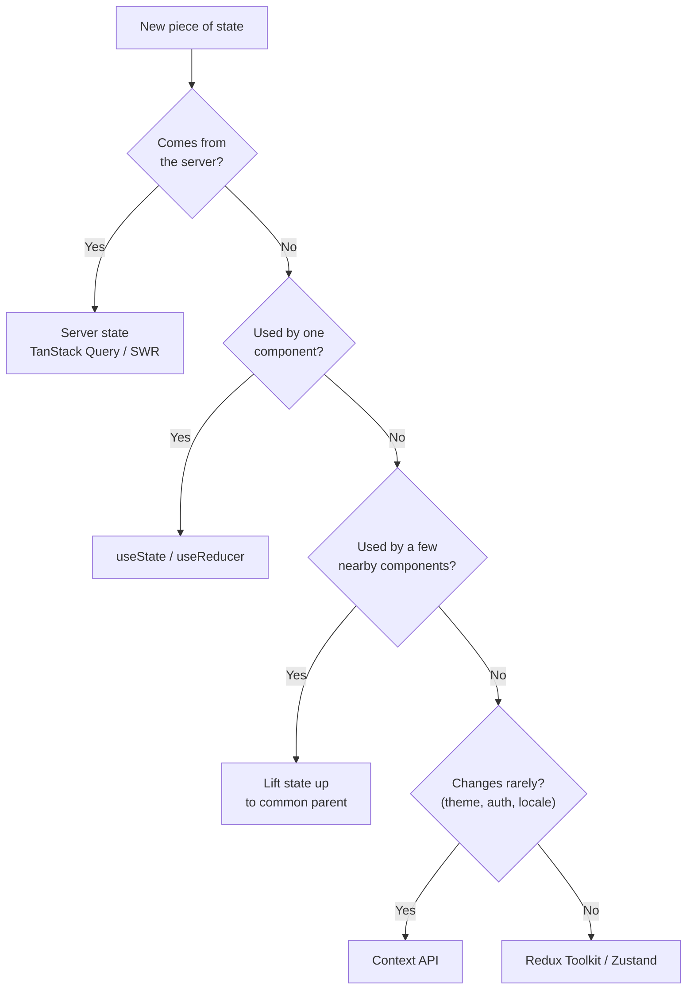

| Local State                                   | Global State                             |
| --------------------------------------------- | ---------------------------------------- |
| Used by one component or a small part of the UI | Shared across many components            |
| Usually managed with `useState` / `useReducer` | Usually managed with Redux, Zustand, Context, etc. |
| Example: input value, modal open/close        | Example: logged-in user, theme, cart     |
| Easier to manage                              | More complex to manage                   |

**Rule:** start with local state. Lift it up to the nearest common parent when two siblings need it. Use global state only when many distant components need it.

---
