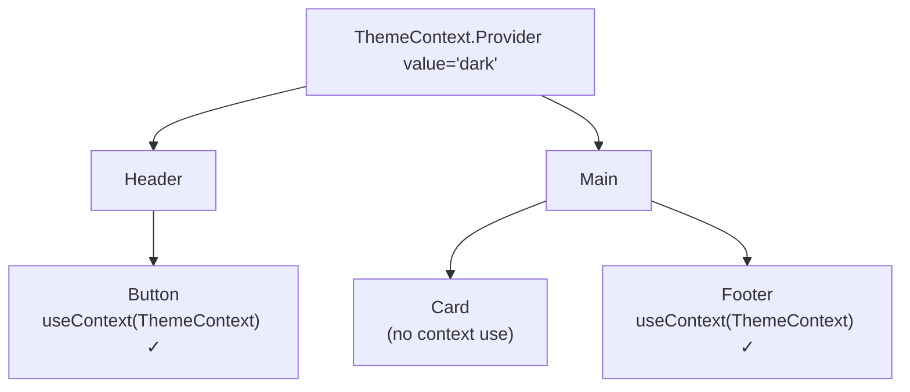

Context lets you pass a value deep into the tree **without prop drilling**.

Used for theme, authentication, and other global values that **change rarely**.



```jsx
const ThemeContext = createContext('light');

function App() {
  const [theme, setTheme] = useState('dark');
  return (
    <ThemeContext.Provider value={theme}>
      <Page />
    </ThemeContext.Provider>
  );
}

function Button() {
  const theme = useContext(ThemeContext);
  return <button className={theme}>Click</button>;
}
```

**Note**: When the Context value changes, **every component that consumes that context** re-renders — even if it only uses one part of the value. Components that don't call `useContext` are not re-rendered by the context itself.

**Tip:** split large contexts (for example `AuthContext` and `ThemeContext` separately) and memoize the value object with `useMemo` to avoid unnecessary re-renders.


---
