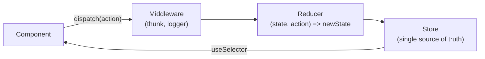

Redux is used for complex, frequently updated shared state, with middleware support.

Redux stores shared state in a central store. A component dispatches an action, the reducer handles that action and updates the state, and the component gets the updated state through a selector.

| Concept  | Simple Meaning                    |
| -------- | --------------------------------- |
| Store    | Holds the application state (single central store) |
| Action   | Describes what happened, e.g. `{ type: 'cart/add', payload: item }` |
| Reducer  | Pure function: current state + action → new state |
| Dispatch | Sends an action to Redux          |
| Selector | Reads data from the store         |

When state changes, only components whose **selected value** changed re-render.

### Three principles of Redux

1. **Single source of truth** — one store.
2. **State is read-only** — change it only by dispatching actions.
3. **Changes are made with pure reducers** — no side effects, no mutation (Redux Toolkit lets you write "mutating" code safely via Immer).

---
