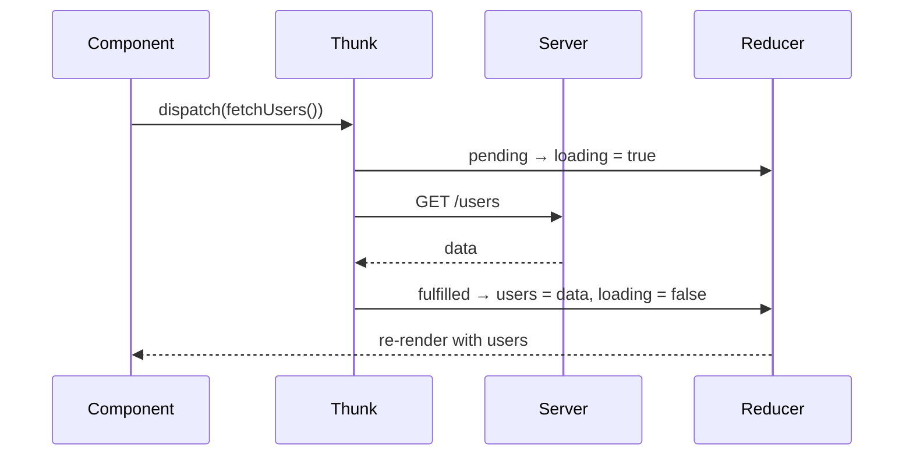

Reducers must be pure, so async work goes in **middleware** — usually `createAsyncThunk`.



```js
export const fetchUsers = createAsyncThunk('users/fetch', async () => {
  const res = await fetch('/api/users');
  return res.json();
});
```

For API data, many teams now use **RTK Query** or **TanStack Query** instead of writing thunks by hand (see Q8).

---
