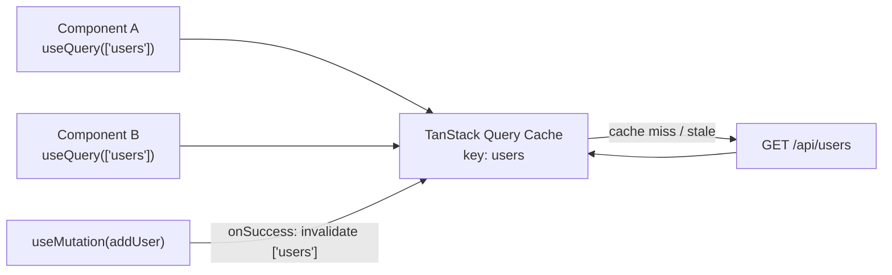

**Server state** is data owned by the backend (users, products). It can become stale, needs loading/error handling, caching, and refetching. Storing it in Redux by hand means writing all of that yourself.



```jsx
import { useQuery } from '@tanstack/react-query';

function Users() {
  const { data, isLoading, error } = useQuery({
    queryKey: ['users'],
    queryFn: () => fetch('/api/users').then((res) => res.json()),
    staleTime: 60_000,
  });

  if (isLoading) return <p>Loading...</p>;
  if (error) return <p>Something went wrong</p>;
  return data.map((user) => <p key={user.id}>{user.name}</p>);
}
```

What you get for free:

- Caching and **deduplication** (two components, one request)
- Loading and error states
- Background refetching (on window focus, reconnect)
- Retries
- Pagination and infinite scroll helpers
- Cache invalidation after mutations

**Modern pattern:** TanStack Query for server state + `useState` / Context / Zustand for the small amount of client state left.

---
