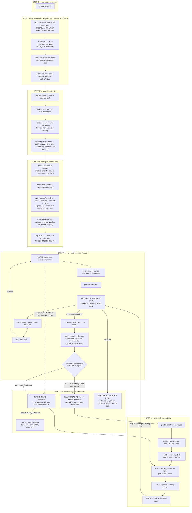

One diagram, start to finish: process creation → which file gets read → who does which task → how the result comes back.

The one sentence version: **Node reads one file, compiles it, runs it on a single main thread, and from then on the only job of that main thread is to run callbacks in phases — real work is pushed to the thread pool, the OS, or worker threads, and every answer comes back as a queued callback on the next turn of the same loop.**

### How to explain it in the interview (memorize these 6 words)

**Process → Read → Compile → Run → Loop → Callback**

| # | Word      | What you say                                                                                     |
| - | --------- | ------------------------------------------------------------------------------------------------ |
| 1 | **Process** | "When I run `node server.js`, the OS creates a new process. C++ code boots up V8 and libuv first — this happens before my JavaScript exists." |
| 2 | **Read**   | "Then Node reads **one** file from disk — my entry file — and reads it in the background using the thread pool." |
| 3 | **Compile**| "V8 compiles that file: source to AST to bytecode, and hot code to real machine code."              |
| 4 | **Run**    | "It runs my code top to bottom. Every `require()` repeats the same steps and is cached, so files load once." |
| 5 | **Loop**   | "When `listen()` returns, my code is done. The main thread is now free and only runs the event loop: timers, poll, check, close — forever." |
| 6 | **Callback**| "Real work goes to the thread pool, the OS, or worker threads. Every result comes back as a callback queued on the next turn of the loop." |

### The 30-second spoken answer

> "When I type `node server.js` the OS creates a new process. Before any of my JavaScript runs, C++ code sets up the V8 engine and libuv. Then Node reads exactly one file — my entry file — compiles it with V8, and runs it. Any `require()` pulls in another file the same way and caches it. When my top-level code finishes, the main thread is free, and from that moment its only job is the event loop: timers, poll, check, close. When I need a file or DNS, that job is handed to the thread pool, and the answer comes back as a callback on the next turn of the loop. So one thread, many requests — non-blocking."

### If they ask a follow-up

| Question                                 | Answer in one line                                                                                    |
| ---------------------------------------- | ----------------------------------------------------------------------------------------------------- |
| Why is there only one thread?            | Because JavaScript is single-threaded. Adding threads to run JS would need locks, and shared mutable state would break. |
| Then how does it handle 10,000 users?    | I/O is handled by the OS and the thread pool, so the main thread only ever runs short callbacks.       |
| Where does the result come back?         | As a callback. The thread finishes, queues the callback, and the loop runs it on a later turn.       |
| What if the work is CPU-heavy?           | The thread pool only offloads I/O, so for real CPU work I use `worker_threads` or `cluster`.           |
| How do you scale it further?             | Run multiple processes with `cluster` or the container orchestrator, and put Nginx in front.          |

---
