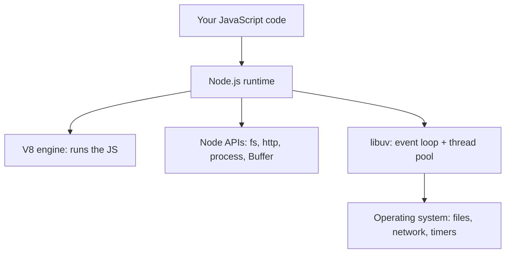

- **Runtime environment** that allows JavaScript to run outside the browser (typically on a server)
- Built on Chrome's **V8 engine** to execute JavaScript
- **Event-driven, non-blocking** architecture (handles multiple simultaneous connections)
- Fast due to event loop + non-blocking I/O

### Node.js adds server-side capabilities

- File system access (`fs`)
- Networking (`http`, `net`)
- Process management (`process`)
- Modules and package management via npm

---
