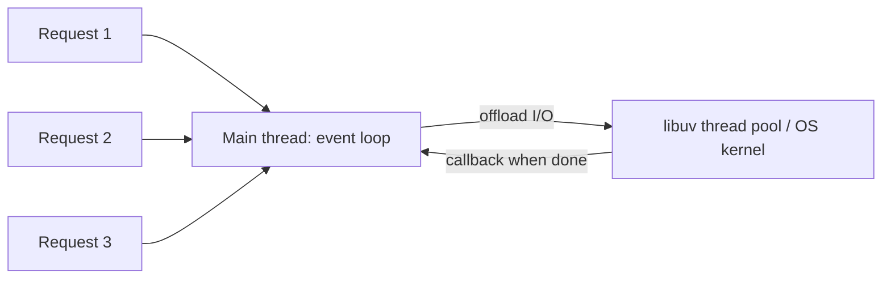

- Node.js uses a **single main thread** (event loop thread) to run JavaScript
- Uses the **event loop + callback queues** to handle concurrency

When an I/O operation (like reading a file) is requested, Node offloads it to the libuv thread pool or the OS kernel. The event loop continues with other work, and when the operation completes its callback is queued for the main thread.

"Single-threaded" means **your JS runs on one thread**. Node itself uses extra threads (libuv thread pool, V8 GC threads).

### Why not for CPU-heavy tasks?

- A long computation blocks the single thread, so **every** other request waits
- Offload them with `worker_threads` or `cluster` instead

---
