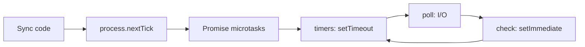

| API                   | Runs when                                     | Priority |
| --------------------- | --------------------------------------------- | -------- |
| `process.nextTick()`  | Right after the current operation, before promises | Highest |
| `Promise.then()`      | After the nextTick queue                      | High     |
| `setTimeout(fn, 0)`   | Timers phase (minimum ~1ms delay)             | Lower    |
| `setImmediate()`      | Check phase (right after poll)                | Lower    |

**setTimeout vs setImmediate ordering:**

- In the **main module** the order is **not guaranteed** (depends on process performance).
- Inside an **I/O callback**, `setImmediate` **always** runs first (check comes right after poll).

```javascript
setTimeout(() => console.log('timeout'), 0);
setImmediate(() => console.log('immediate'));
// Main module: either order is possible
```



---
