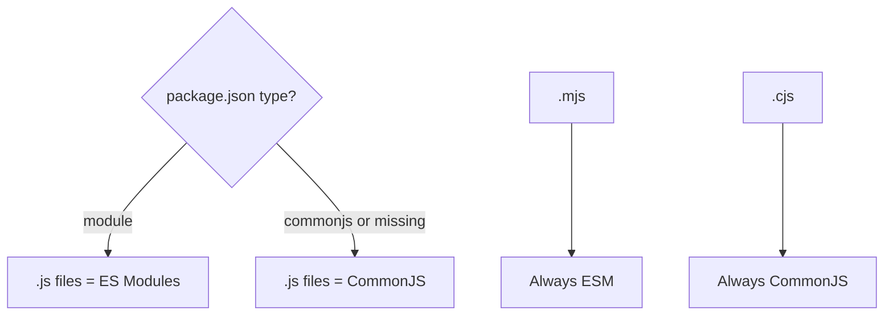

| Feature       | CommonJS                        | ES Modules                         |
| ------------- | ------------------------------- | ---------------------------------- |
| Syntax        | `require()`                     | `import/export`                    |
| Export        | `module.exports`                | `export` / `export default`        |
| Loading       | Synchronous, at runtime         | Asynchronous, statically analyzed  |
| File type     | `.js` (default) or `.cjs`       | `.mjs` or `"type": "module"`       |
| Top-level await | No                            | Yes                                |
| `__dirname`   | Available                       | Not available (use `import.meta.dirname` / `import.meta.url`) |
| Tree-shaking  | Hard                            | Easy (static imports)              |

```javascript
// CommonJS
const { add } = require('./math');
module.exports = { add };

// ES Modules
import { add } from './math.js'; // extension required
export { add };
```



---
