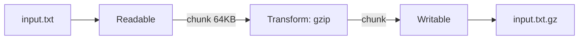

Objects used to handle data piece-by-piece (chunks) instead of loading everything into memory.

### Types of Streams

1. **Readable**: Read data (e.g., `fs.createReadStream`, `req` in a server)
2. **Writable**: Write data (e.g., `fs.createWriteStream`, `res` in a server)
3. **Duplex**: Read + write (e.g., TCP sockets)
4. **Transform**: Modify data while reading/writing (e.g., `zlib.createGzip()`)

### Stream Events

Streams are based on EventEmitter:

- **Readable**: `data` (chunk available), `end` (no more data), `error`, `close`
- **Writable**: `finish` (writing completed), `drain` (ready for more data), `error`, `close`

### Piping

Connect streams together — data flows automatically from one stream to another:

```javascript
const fs = require('fs');
const zlib = require('zlib');
const { pipeline } = require('stream/promises');

// pipeline() handles errors and cleanup — prefer it over .pipe()
await pipeline(
  fs.createReadStream('input.txt'),
  zlib.createGzip(),
  fs.createWriteStream('input.txt.gz')
);
```



### Why streams? (memory)

```text
readFile (1 GB file)              createReadStream (1 GB file)
Memory: [██████████ 1 GB]          Memory: [█ 64 KB] → [█ 64 KB] → ...
Whole file loaded at once          One chunk at a time
```

---
