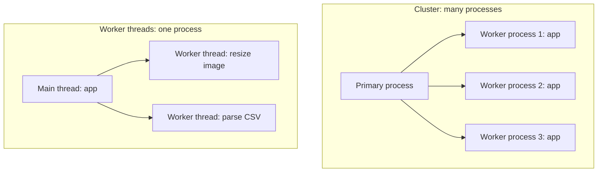

| Worker Threads                    | Cluster                              |
| --------------------------------- | ------------------------------------ |
| Threads inside one process        | Separate processes                   |
| Can share memory                  | No shared memory                     |
| For CPU-heavy computation         | For scaling an HTTP server across CPU cores |
| One crash can affect the process  | One worker crash doesn't kill others |

In production, process managers (PM2) or containers (Kubernetes replicas) often replace hand-written cluster code.

### Scaling

- **Vertical**: increase the power of one server (more CPU/RAM)
- **Horizontal**: run multiple servers behind a load balancer

---
