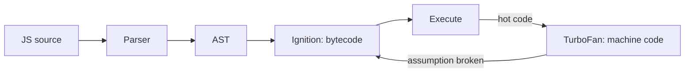

- Open-source JavaScript engine developed by Google
- Used in Google Chrome and Node.js
- Converts JavaScript into machine code that the processor can execute directly

### What is the relationship between Node.js and V8?

- **Node.js** = runtime environment
- **V8** = JavaScript engine inside Node.js

Node.js uses V8 to execute JavaScript outside the browser. Node adds file system (fs), networking (http), and OS-level features.

So: V8 executes JS, Node.js provides environment + APIs. Node.js cannot run without V8 — it is built on it.

### How V8 compiles JavaScript

V8 uses **Just-In-Time (JIT) compilation** — code is compiled during execution, not ahead of time like C++.

1. **Parsing**: JS code → Abstract Syntax Tree (AST)
2. **Ignition (Interpreter)**: AST → Bytecode, and runs it
3. **TurboFan (Optimizer)**: hot (frequently used) code → optimized machine code
4. **Deoptimization**: if assumptions break (e.g. a type changes), V8 falls back to bytecode

---
