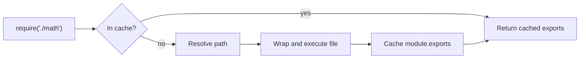

### What is npm?

Package manager to install and manage dependencies.

### What are modules in Node.js?

Reusable blocks of code — each file is treated as a module with its own scope.

### Types of Modules

- **Built-in**: fs, http, path, os, events, stream, util, crypto
- **Custom**: Your local files
- **Third-party**: Installed via npm

### Key Functions

- `require()`: Import modules (synchronous). Loads module, executes it, caches it, returns exported object.
- `module.exports`: Export data from a module. Whatever you assign to module.exports is what `require()` returns.

### Core Modules of Node.js

Built-in modules (no installation needed):

- **fs**: File system operations
- **http**: Create HTTP servers/clients
- **path**: File path manipulation
- **os**: Operating system information
- **events**: Event handling
- **stream**: Data streaming
- **util**: Utility functions
- **crypto**: Cryptographic operations
- **Buffer**: Binary data handling (global)
- **process**: Process management (global)

---
