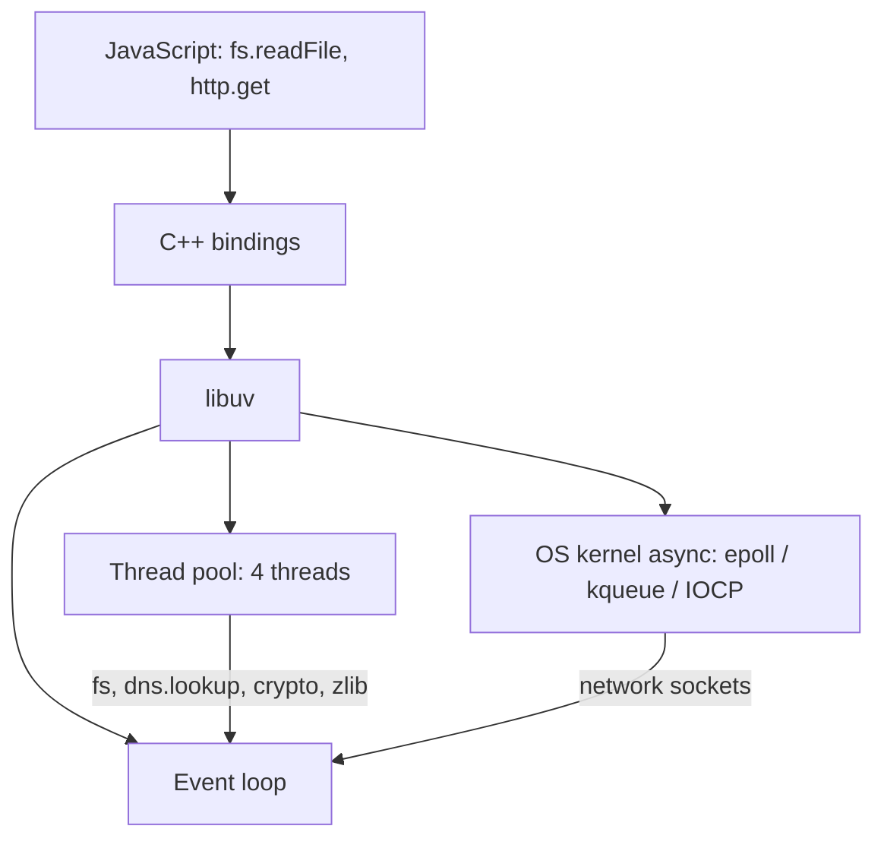

| Component        | What it is                                                                        |
| ---------------- | --------------------------------------------------------------------------------- |
| Main Thread      | The single execution path where V8 runs JS and libuv drives the event loop        |
| Call Stack       | LIFO structure tracking active function calls                                     |
| V8 Engine        | Compiles and executes JS into machine code                                        |
| libuv            | C library providing the event loop, thread pool, and OS async integration         |
| C++ Bindings     | Layer bridging JS APIs (`fs`, `crypto`) to Node's C++ / libuv code                |

### What is libuv?

libuv is the C library that gives Node its **event loop**, its **thread pool**, and its access to **OS kernel** async facilities (epoll, kqueue, IOCP). It is what makes Node's non-blocking I/O possible.

---
