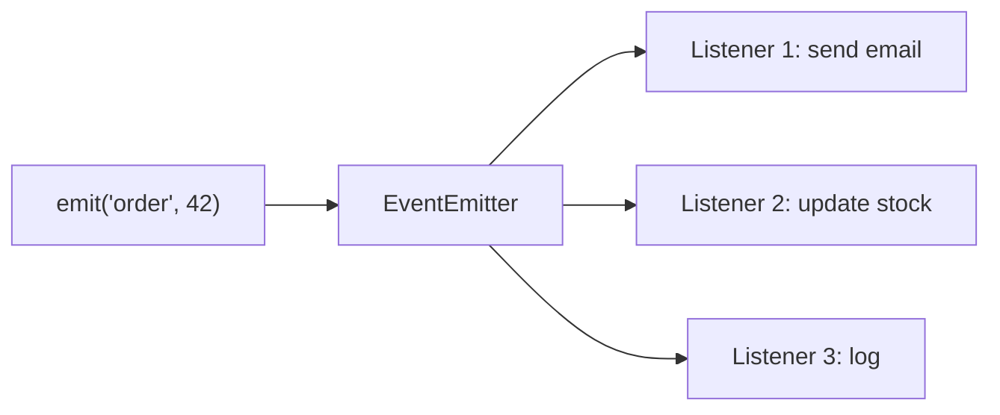

Program execution is driven by events and event handlers. Node uses this model heavily (streams, servers, sockets are all EventEmitters).

### EventEmitter

`EventEmitter` lets one part of your code send a signal with `.emit()` while another part listens with `.on()` and reacts.

```javascript
const EventEmitter = require('events');
const emitter = new EventEmitter();

emitter.on('order', (id) => {
  console.log('Order received:', id);
});

emitter.emit('order', 42); // Order received: 42
```

**Key methods:** `on()`, `once()`, `emit()`, `off()`

Listeners are called **synchronously**, in the order they were registered.



---
