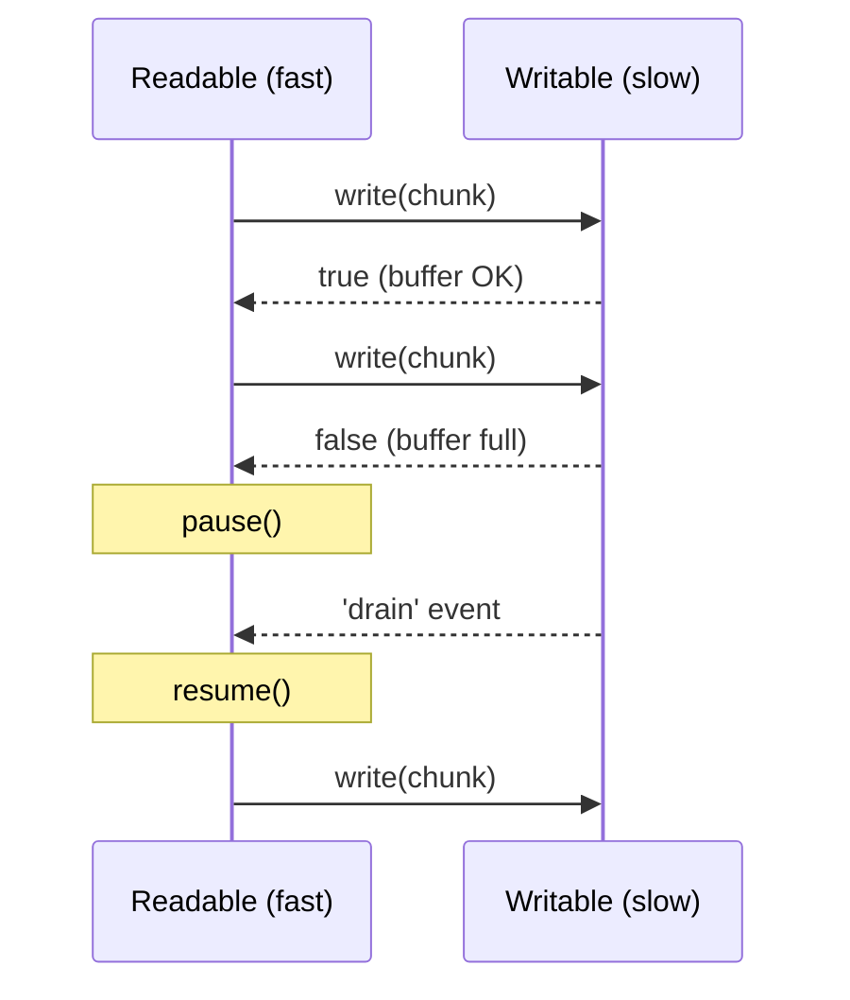

Backpressure happens when the **writer is slower than the reader** (e.g. fast disk read → slow network). Without handling it, chunks pile up in memory.

- `writable.write(chunk)` returns `false` when the internal buffer is full (`highWaterMark`).
- The reader should **pause** until the writable emits `drain`.
- `.pipe()` and `pipeline()` handle this automatically.

```javascript
readable.on('data', (chunk) => {
  const ok = writable.write(chunk);
  if (!ok) {
    readable.pause();
    writable.once('drain', () => readable.resume());
  }
});
```



---
