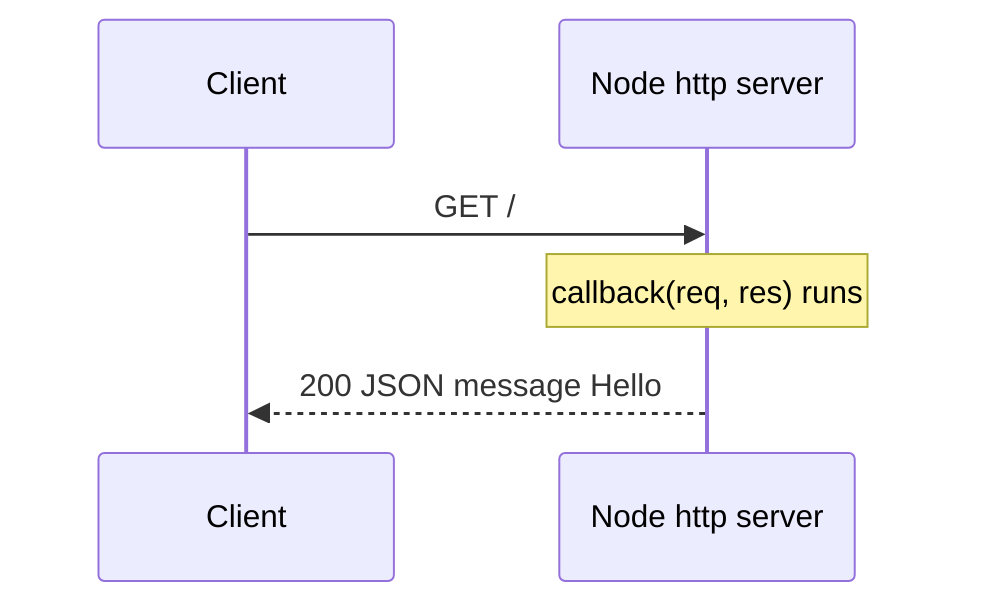

Use `http.createServer()` to create the server and `server.listen()` to start it on a port.

```javascript
const http = require('http');

const server = http.createServer((req, res) => {
  res.writeHead(200, { 'Content-Type': 'application/json' });
  res.end(JSON.stringify({ message: 'Hello' }));
});

server.listen(3000, () => {
  console.log('Server running on port 3000');
});
```



---
