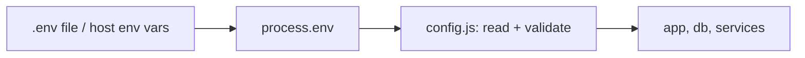

- Config that changes per environment (DB URL, API keys, port) lives in **environment variables**, never in code.
- Read with `process.env.NAME`. Locally, load a `.env` file with `dotenv` or Node 20.6+'s `node --env-file=.env app.js`.
- Commit `.env.example`, **never** commit `.env`.
- Validate config at startup (fail fast if a variable is missing).

```javascript
// config.js — single place that reads process.env
require('dotenv').config();

const config = {
  port: Number(process.env.PORT) || 3000,
  dbUrl: process.env.DATABASE_URL,
};

if (!config.dbUrl) throw new Error('DATABASE_URL is required');
module.exports = config;
```



---
