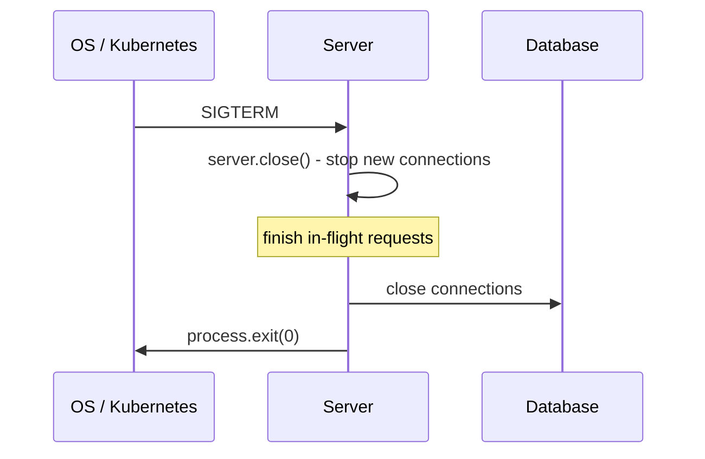

When the server is stopped (deploy, scale-down, Ctrl+C), it should **finish in-flight requests** and close connections cleanly instead of dying mid-request.

1. Listen for `SIGTERM` / `SIGINT`
2. Stop accepting new connections (`server.close()`)
3. Wait for in-flight requests to finish
4. Close DB / Redis / queue connections
5. Exit; force-exit after a timeout if something hangs

```javascript
process.on('SIGTERM', () => {
  console.log('Shutting down...');
  server.close(async () => {
    await db.close();
    process.exit(0);
  });
  setTimeout(() => process.exit(1), 10_000).unref(); // force exit
});
```



### uncaughtException and unhandledRejection

```javascript
process.on('unhandledRejection', (reason) => { console.error(reason); process.exit(1); });
process.on('uncaughtException', (err) => { console.error(err); process.exit(1); });
```

After an uncaught exception the process is in an unknown state — **log and exit**, and let a process manager (PM2, Docker, Kubernetes) restart it. Do not keep serving.

---
