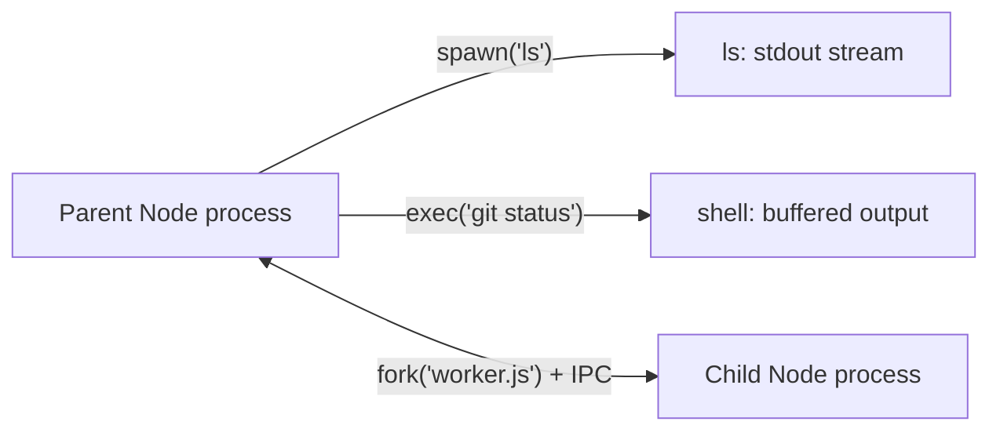

Child processes let Node execute another program.

| Method       | Use                                                       |
| ------------ | --------------------------------------------------------- |
| `spawn()`    | Launch a new process and stream its output                |
| `exec()`     | Run a shell command and buffer the full output            |
| `execFile()` | Run an executable directly, without a shell               |
| `fork()`     | Spawn a new **Node** process with a built-in message channel |

### spawn() vs fork()

| `spawn()`                       | `fork()`                                  |
| ------------------------------- | ----------------------------------------- |
| Runs any executable             | Runs a Node.js module                     |
| Communicates through streams    | Has built-in IPC (`send` / `on('message')`) |
| Good for long-running commands  | Good for Node worker processes            |

`fork()` is a special case of `spawn()`.

---
