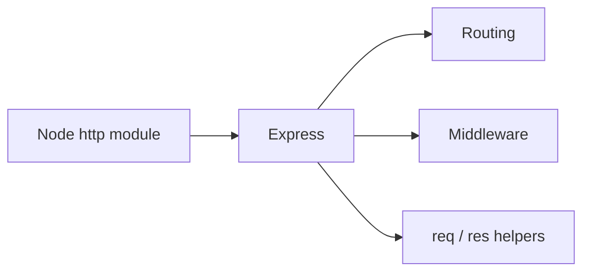

Minimal web framework for Node.js to build APIs and web apps. It adds routing, middleware, and request/response helpers on top of the `http` module.

```javascript
const express = require('express');
const app = express();
const port = 3000;

app.use(express.json());

app.get('/', (req, res) => {
  res.send('Hello World!');
});

app.listen(port, () => {
  console.log(`Server running on port ${port}`);
});
```

### Key Features of Express.js

- **Minimalist & Flexible**: Lightweight with minimal core features
- **Routing**: Simple and powerful URL routing
- **Middleware**: Request/response processing pipeline
- **Template Engines**: Dynamic HTML rendering (EJS, Pug, Handlebars)
- **Error Handling**: Built-in error-handling middleware
- **HTTP Helpers**: `res.json()`, `res.status()`, `res.redirect()`



---
