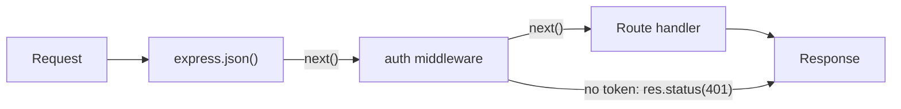

Functions that run between receiving the request and sending the response. Each one can read/modify `req` and `res`, end the request, or call `next()`.

```javascript
app.use((req, res, next) => {
  console.log(req.method, req.url);
  next();
});
```

### Middleware Parameters

- `req`: Request object (data from client)
- `res`: Response object (send data to client)
- `next()`: Pass control to next middleware

### Role of next() in Express Middleware

- `next()` passes control to the next matching middleware/route
- If `next()` is not called **and** no response is sent, the request hangs
- `next('route')` skips the remaining callbacks of the current route (only in `app.METHOD()` / `router.METHOD()`)
- `next(err)` skips to the error-handling middleware

### Types of Middleware

- **Application-level**: `app.use()`, `app.get()`
- **Router-level**: `router.use()`
- **Built-in**: `express.json()`, `express.static()`, `express.urlencoded()`
- **Third-party**: cors, morgan, helmet, multer
- **Error-handling**: 4 parameters `(err, req, res, next)`



### app.use() vs app.METHOD()

- `app.use(path?, fn)`: Runs for **every HTTP method**, on any path that **starts with** `path` (default `/` = all requests)
- `app.METHOD(path, fn)`: Runs only for that HTTP method (GET, POST, PUT, DELETE) and an exact path match

---
