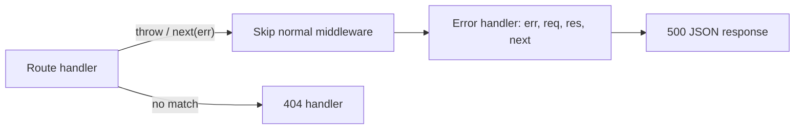

### 404 handler

Placed **after** all routes — it only runs when nothing else matched.

```javascript
app.use((req, res) => {
  res.status(404).json({ error: 'Not Found' });
});
```

### Error-handling middleware

Must have **4 parameters** `(err, req, res, next)` — that is how Express recognizes it. Register it **last**.

```javascript
app.use((err, req, res, next) => {
  console.error(err.stack);
  const status = err.status || 500;
  res.status(status).json({
    error: status === 500 ? 'Internal Server Error' : err.message,
  });
});
```

Never send the stack trace to the client.

### Async errors

- **Express 4**: errors thrown inside `async` handlers are **not** caught automatically — wrap with `try/catch` and call `next(err)`.
- **Express 5**: rejected promises from handlers are forwarded to the error handler automatically.

```javascript
// Express 4
app.get('/async', async (req, res, next) => {
  try {
    const data = await someAsyncOperation();
    res.json(data);
  } catch (err) {
    next(err);
  }
});
```



---
